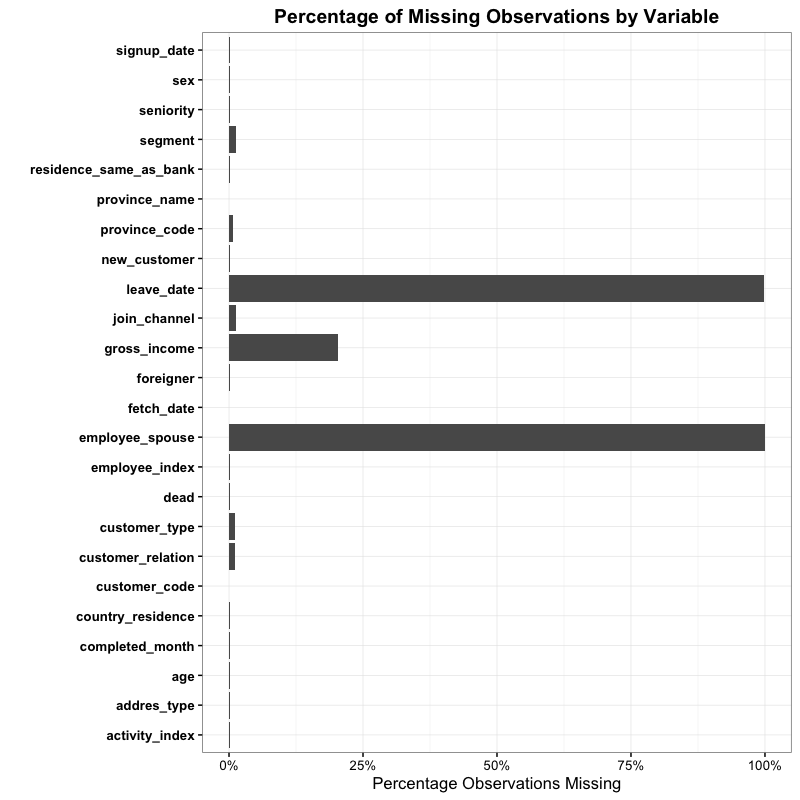
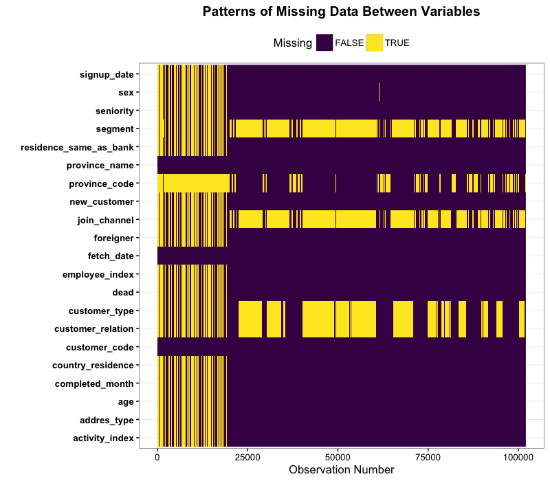

# Missing Data Exploration

While exploring variables I've noticed some interesting patterns with 
missing data and I want to see if there is anything we can learn from 
the variable to variable missingness


```r
suppressPackageStartupMessages(library(readr))
suppressPackageStartupMessages(library(dplyr))
suppressPackageStartupMessages(library(knitr))
suppressPackageStartupMessages(library(tidyr))
suppressPackageStartupMessages(library(purrr))
suppressPackageStartupMessages(library(ggplot2))
source("Santander/lib/helpers.R")
options(dplyr.width = Inf)

raw_data <- read_csv("~/Documents/Data/Kaggle_Comps/Santander/train_ver2.csv", col_types = col_types)
```

```
## 
|                                                                               |   0%           
|                                                                               |   0%    1 MB
|                                                                               |   0%    2 MB
|                                                                               |   0%    3 MB
|                                                                               |   0%    4 MB
|                                                                               |   0%    5 MB
|                                                                               |   0%    5 MB
|                                                                               |   0%    6 MB
|                                                                               |   0%    7 MB
|                                                                               |   0%    8 MB
|                                                                               |   0%    9 MB
|                                                                               |   0%   10 MB
|                                                                               |   0%   10 MB
|                                                                               |   0%   11 MB
|                                                                               |   0%   12 MB
|                                                                               |   0%   13 MB
|                                                                               |   0%   14 MB
|                                                                               |   0%   15 MB
|                                                                               |   0%   15 MB
|                                                                               |   0%   16 MB
|                                                                               |   0%   17 MB
|                                                                               |   0%   18 MB
|                                                                               |   0%   19 MB
|                                                                               |   0%   20 MB
|                                                                               |   0%   20 MB
|                                                                               |   0%   21 MB
|                                                                               |   1%   22 MB
|                                                                               |   1%   23 MB
|                                                                               |   1%   24 MB
|                                                                               |   1%   25 MB
|                                                                               |   1%   25 MB
|                                                                               |   1%   26 MB
|=                                                                              |   1%   27 MB
|=                                                                              |   1%   28 MB
|=                                                                              |   1%   29 MB
|=                                                                              |   1%   30 MB
|=                                                                              |   1%   31 MB
|=                                                                              |   1%   31 MB
|=                                                                              |   1%   32 MB
|=                                                                              |   1%   33 MB
|=                                                                              |   1%   34 MB
|=                                                                              |   1%   35 MB
|=                                                                              |   1%   36 MB
|=                                                                              |   1%   36 MB
|=                                                                              |   1%   37 MB
|=                                                                              |   1%   38 MB
|=                                                                              |   1%   39 MB
|=                                                                              |   1%   40 MB
|=                                                                              |   1%   41 MB
|=                                                                              |   1%   41 MB
|=                                                                              |   1%   42 MB
|=                                                                              |   1%   43 MB
|=                                                                              |   2%   44 MB
|=                                                                              |   2%   45 MB
|=                                                                              |   2%   46 MB
|=                                                                              |   2%   46 MB
|=                                                                              |   2%   47 MB
|=                                                                              |   2%   48 MB
|=                                                                              |   2%   49 MB
|=                                                                              |   2%   50 MB
|=                                                                              |   2%   51 MB
|=                                                                              |   2%   51 MB
|=                                                                              |   2%   52 MB
|=                                                                              |   2%   53 MB
|=                                                                              |   2%   54 MB
|==                                                                             |   2%   55 MB
|==                                                                             |   2%   56 MB
|==                                                                             |   2%   56 MB
|==                                                                             |   2%   57 MB
|==                                                                             |   2%   58 MB
|==                                                                             |   2%   59 MB
|==                                                                             |   2%   60 MB
|==                                                                             |   2%   61 MB
|==                                                                             |   2%   61 MB
|==                                                                             |   2%   62 MB
|==                                                                             |   2%   63 MB
|==                                                                             |   2%   64 MB
|==                                                                             |   2%   65 MB
|==                                                                             |   3%   66 MB
|==                                                                             |   3%   66 MB
|==                                                                             |   3%   67 MB
|==                                                                             |   3%   68 MB
|==                                                                             |   3%   69 MB
|==                                                                             |   3%   70 MB
|==                                                                             |   3%   71 MB
|==                                                                             |   3%   71 MB
|==                                                                             |   3%   72 MB
|==                                                                             |   3%   73 MB
|==                                                                             |   3%   74 MB
|==                                                                             |   3%   75 MB
|==                                                                             |   3%   76 MB
|==                                                                             |   3%   76 MB
|==                                                                             |   3%   77 MB
|==                                                                             |   3%   78 MB
|==                                                                             |   3%   79 MB
|==                                                                             |   3%   80 MB
|==                                                                             |   3%   81 MB
|==                                                                             |   3%   81 MB
|===                                                                            |   3%   82 MB
|===                                                                            |   3%   83 MB
|===                                                                            |   3%   84 MB
|===                                                                            |   3%   85 MB
|===                                                                            |   3%   85 MB
|===                                                                            |   3%   86 MB
|===                                                                            |   4%   87 MB
|===                                                                            |   4%   88 MB
|===                                                                            |   4%   89 MB
|===                                                                            |   4%   90 MB
|===                                                                            |   4%   90 MB
|===                                                                            |   4%   91 MB
|===                                                                            |   4%   92 MB
|===                                                                            |   4%   93 MB
|===                                                                            |   4%   94 MB
|===                                                                            |   4%   95 MB
|===                                                                            |   4%   95 MB
|===                                                                            |   4%   96 MB
|===                                                                            |   4%   97 MB
|===                                                                            |   4%   98 MB
|===                                                                            |   4%   99 MB
|===                                                                            |   4%  100 MB
|===                                                                            |   4%  100 MB
|===                                                                            |   4%  101 MB
|===                                                                            |   4%  102 MB
|===                                                                            |   4%  103 MB
|===                                                                            |   4%  104 MB
|===                                                                            |   4%  105 MB
|===                                                                            |   4%  105 MB
|===                                                                            |   4%  106 MB
|===                                                                            |   4%  107 MB
|===                                                                            |   4%  108 MB
|===                                                                            |   4%  109 MB
|====                                                                           |   5%  110 MB
|====                                                                           |   5%  110 MB
|====                                                                           |   5%  111 MB
|====                                                                           |   5%  112 MB
|====                                                                           |   5%  113 MB
|====                                                                           |   5%  114 MB
|====                                                                           |   5%  115 MB
|====                                                                           |   5%  115 MB
|====                                                                           |   5%  116 MB
|====                                                                           |   5%  117 MB
|====                                                                           |   5%  118 MB
|====                                                                           |   5%  119 MB
|====                                                                           |   5%  120 MB
|====                                                                           |   5%  120 MB
|====                                                                           |   5%  121 MB
|====                                                                           |   5%  122 MB
|====                                                                           |   5%  123 MB
|====                                                                           |   5%  124 MB
|====                                                                           |   5%  125 MB
|====                                                                           |   5%  125 MB
|====                                                                           |   5%  126 MB
|====                                                                           |   5%  127 MB
|====                                                                           |   5%  128 MB
|====                                                                           |   5%  129 MB
|====                                                                           |   5%  130 MB
|====                                                                           |   5%  130 MB
|====                                                                           |   6%  131 MB
|====                                                                           |   6%  132 MB
|====                                                                           |   6%  133 MB
|====                                                                           |   6%  134 MB
|====                                                                           |   6%  135 MB
|====                                                                           |   6%  135 MB
|=====                                                                          |   6%  136 MB
|=====                                                                          |   6%  137 MB
|=====                                                                          |   6%  138 MB
|=====                                                                          |   6%  139 MB
|=====                                                                          |   6%  140 MB
|=====                                                                          |   6%  140 MB
|=====                                                                          |   6%  141 MB
|=====                                                                          |   6%  142 MB
|=====                                                                          |   6%  143 MB
|=====                                                                          |   6%  144 MB
|=====                                                                          |   6%  145 MB
|=====                                                                          |   6%  145 MB
|=====                                                                          |   6%  146 MB
|=====                                                                          |   6%  147 MB
|=====                                                                          |   6%  148 MB
|=====                                                                          |   6%  149 MB
|=====                                                                          |   6%  150 MB
|=====                                                                          |   6%  150 MB
|=====                                                                          |   6%  151 MB
|=====                                                                          |   6%  152 MB
|=====                                                                          |   7%  153 MB
|=====                                                                          |   7%  154 MB
|=====                                                                          |   7%  155 MB
|=====                                                                          |   7%  155 MB
|=====                                                                          |   7%  156 MB
|=====                                                                          |   7%  157 MB
|=====                                                                          |   7%  158 MB
|=====                                                                          |   7%  159 MB
|=====                                                                          |   7%  160 MB
|=====                                                                          |   7%  160 MB
|=====                                                                          |   7%  161 MB
|=====                                                                          |   7%  162 MB
|=====                                                                          |   7%  163 MB
|======                                                                         |   7%  164 MB
|======                                                                         |   7%  165 MB
|======                                                                         |   7%  165 MB
|======                                                                         |   7%  166 MB
|======                                                                         |   7%  167 MB
|======                                                                         |   7%  168 MB
|======                                                                         |   7%  169 MB
|======                                                                         |   7%  170 MB
|======                                                                         |   7%  170 MB
|======                                                                         |   7%  171 MB
|======                                                                         |   7%  172 MB
|======                                                                         |   7%  173 MB
|======                                                                         |   7%  174 MB
|======                                                                         |   8%  175 MB
|======                                                                         |   8%  176 MB
|======                                                                         |   8%  176 MB
|======                                                                         |   8%  177 MB
|======                                                                         |   8%  178 MB
|======                                                                         |   8%  179 MB
|======                                                                         |   8%  180 MB
|======                                                                         |   8%  181 MB
|======                                                                         |   8%  181 MB
|======                                                                         |   8%  182 MB
|======                                                                         |   8%  183 MB
|======                                                                         |   8%  184 MB
|======                                                                         |   8%  185 MB
|======                                                                         |   8%  186 MB
|======                                                                         |   8%  186 MB
|======                                                                         |   8%  187 MB
|======                                                                         |   8%  188 MB
|======                                                                         |   8%  189 MB
|======                                                                         |   8%  190 MB
|======                                                                         |   8%  191 MB
|=======                                                                        |   8%  191 MB
|=======                                                                        |   8%  192 MB
|=======                                                                        |   8%  193 MB
|=======                                                                        |   8%  194 MB
|=======                                                                        |   8%  195 MB
|=======                                                                        |   8%  196 MB
|=======                                                                        |   9%  196 MB
|=======                                                                        |   9%  197 MB
|=======                                                                        |   9%  198 MB
|=======                                                                        |   9%  199 MB
|=======                                                                        |   9%  200 MB
|=======                                                                        |   9%  201 MB
|=======                                                                        |   9%  202 MB
|=======                                                                        |   9%  202 MB
|=======                                                                        |   9%  203 MB
|=======                                                                        |   9%  204 MB
|=======                                                                        |   9%  205 MB
|=======                                                                        |   9%  206 MB
|=======                                                                        |   9%  207 MB
|=======                                                                        |   9%  207 MB
|=======                                                                        |   9%  208 MB
|=======                                                                        |   9%  209 MB
|=======                                                                        |   9%  210 MB
|=======                                                                        |   9%  211 MB
|=======                                                                        |   9%  212 MB
|=======                                                                        |   9%  212 MB
|=======                                                                        |   9%  213 MB
|=======                                                                        |   9%  214 MB
|=======                                                                        |   9%  215 MB
|=======                                                                        |   9%  216 MB
|=======                                                                        |   9%  216 MB
|=======                                                                        |   9%  217 MB
|=======                                                                        |   9%  218 MB
|========                                                                       |  10%  219 MB
|========                                                                       |  10%  220 MB
|========                                                                       |  10%  221 MB
|========                                                                       |  10%  221 MB
|========                                                                       |  10%  222 MB
|========                                                                       |  10%  223 MB
|========                                                                       |  10%  224 MB
|========                                                                       |  10%  225 MB
|========                                                                       |  10%  226 MB
|========                                                                       |  10%  226 MB
|========                                                                       |  10%  227 MB
|========                                                                       |  10%  228 MB
|========                                                                       |  10%  229 MB
|========                                                                       |  10%  230 MB
|========                                                                       |  10%  231 MB
|========                                                                       |  10%  231 MB
|========                                                                       |  10%  232 MB
|========                                                                       |  10%  233 MB
|========                                                                       |  10%  234 MB
|========                                                                       |  10%  235 MB
|========                                                                       |  10%  236 MB
|========                                                                       |  10%  236 MB
|========                                                                       |  10%  237 MB
|========                                                                       |  10%  238 MB
|========                                                                       |  10%  239 MB
|========                                                                       |  10%  240 MB
|========                                                                       |  11%  241 MB
|========                                                                       |  11%  241 MB
|========                                                                       |  11%  242 MB
|========                                                                       |  11%  243 MB
|========                                                                       |  11%  244 MB
|========                                                                       |  11%  245 MB
|=========                                                                      |  11%  246 MB
|=========                                                                      |  11%  246 MB
|=========                                                                      |  11%  247 MB
|=========                                                                      |  11%  248 MB
|=========                                                                      |  11%  249 MB
|=========                                                                      |  11%  250 MB
|=========                                                                      |  11%  251 MB
|=========                                                                      |  11%  251 MB
|=========                                                                      |  11%  252 MB
|=========                                                                      |  11%  253 MB
|=========                                                                      |  11%  254 MB
|=========                                                                      |  11%  255 MB
|=========                                                                      |  11%  256 MB
|=========                                                                      |  11%  256 MB
|=========                                                                      |  11%  257 MB
|=========                                                                      |  11%  258 MB
|=========                                                                      |  11%  259 MB
|=========                                                                      |  11%  260 MB
|=========                                                                      |  11%  261 MB
|=========                                                                      |  11%  261 MB
|=========                                                                      |  12%  262 MB
|=========                                                                      |  12%  263 MB
|=========                                                                      |  12%  264 MB
|=========                                                                      |  12%  265 MB
|=========                                                                      |  12%  266 MB
|=========                                                                      |  12%  267 MB
|=========                                                                      |  12%  267 MB
|=========                                                                      |  12%  268 MB
|=========                                                                      |  12%  269 MB
|=========                                                                      |  12%  270 MB
|=========                                                                      |  12%  271 MB
|=========                                                                      |  12%  272 MB
|=========                                                                      |  12%  272 MB
|==========                                                                     |  12%  273 MB
|==========                                                                     |  12%  274 MB
|==========                                                                     |  12%  275 MB
|==========                                                                     |  12%  276 MB
|==========                                                                     |  12%  277 MB
|==========                                                                     |  12%  277 MB
|==========                                                                     |  12%  278 MB
|==========                                                                     |  12%  279 MB
|==========                                                                     |  12%  280 MB
|==========                                                                     |  12%  281 MB
|==========                                                                     |  12%  282 MB
|==========                                                                     |  12%  282 MB
|==========                                                                     |  12%  283 MB
|==========                                                                     |  13%  284 MB
|==========                                                                     |  13%  285 MB
|==========                                                                     |  13%  286 MB
|==========                                                                     |  13%  287 MB
|==========                                                                     |  13%  287 MB
|==========                                                                     |  13%  288 MB
|==========                                                                     |  13%  289 MB
|==========                                                                     |  13%  290 MB
|==========                                                                     |  13%  291 MB
|==========                                                                     |  13%  292 MB
|==========                                                                     |  13%  293 MB
|==========                                                                     |  13%  293 MB
|==========                                                                     |  13%  294 MB
|==========                                                                     |  13%  295 MB
|==========                                                                     |  13%  296 MB
|==========                                                                     |  13%  297 MB
|==========                                                                     |  13%  298 MB
|==========                                                                     |  13%  298 MB
|==========                                                                     |  13%  299 MB
|==========                                                                     |  13%  300 MB
|===========                                                                    |  13%  301 MB
|===========                                                                    |  13%  302 MB
|===========                                                                    |  13%  303 MB
|===========                                                                    |  13%  303 MB
|===========                                                                    |  13%  304 MB
|===========                                                                    |  13%  305 MB
|===========                                                                    |  14%  306 MB
|===========                                                                    |  14%  307 MB
|===========                                                                    |  14%  308 MB
|===========                                                                    |  14%  308 MB
|===========                                                                    |  14%  309 MB
|===========                                                                    |  14%  310 MB
|===========                                                                    |  14%  311 MB
|===========                                                                    |  14%  312 MB
|===========                                                                    |  14%  313 MB
|===========                                                                    |  14%  313 MB
|===========                                                                    |  14%  314 MB
|===========                                                                    |  14%  315 MB
|===========                                                                    |  14%  316 MB
|===========                                                                    |  14%  317 MB
|===========                                                                    |  14%  318 MB
|===========                                                                    |  14%  318 MB
|===========                                                                    |  14%  319 MB
|===========                                                                    |  14%  320 MB
|===========                                                                    |  14%  321 MB
|===========                                                                    |  14%  322 MB
|===========                                                                    |  14%  323 MB
|===========                                                                    |  14%  323 MB
|===========                                                                    |  14%  324 MB
|===========                                                                    |  14%  325 MB
|===========                                                                    |  14%  326 MB
|===========                                                                    |  14%  327 MB
|============                                                                   |  15%  328 MB
|============                                                                   |  15%  328 MB
|============                                                                   |  15%  329 MB
|============                                                                   |  15%  330 MB
|============                                                                   |  15%  331 MB
|============                                                                   |  15%  332 MB
|============                                                                   |  15%  333 MB
|============                                                                   |  15%  333 MB
|============                                                                   |  15%  334 MB
|============                                                                   |  15%  335 MB
|============                                                                   |  15%  336 MB
|============                                                                   |  15%  337 MB
|============                                                                   |  15%  338 MB
|============                                                                   |  15%  338 MB
|============                                                                   |  15%  339 MB
|============                                                                   |  15%  340 MB
|============                                                                   |  15%  341 MB
|============                                                                   |  15%  342 MB
|============                                                                   |  15%  343 MB
|============                                                                   |  15%  343 MB
|============                                                                   |  15%  344 MB
|============                                                                   |  15%  345 MB
|============                                                                   |  15%  346 MB
|============                                                                   |  15%  347 MB
|============                                                                   |  15%  348 MB
|============                                                                   |  15%  348 MB
|============                                                                   |  15%  349 MB
|============                                                                   |  16%  350 MB
|============                                                                   |  16%  351 MB
|============                                                                   |  16%  352 MB
|============                                                                   |  16%  353 MB
|============                                                                   |  16%  353 MB
|============                                                                   |  16%  354 MB
|=============                                                                  |  16%  355 MB
|=============                                                                  |  16%  356 MB
|=============                                                                  |  16%  357 MB
|=============                                                                  |  16%  358 MB
|=============                                                                  |  16%  358 MB
|=============                                                                  |  16%  359 MB
|=============                                                                  |  16%  360 MB
|=============                                                                  |  16%  361 MB
|=============                                                                  |  16%  362 MB
|=============                                                                  |  16%  363 MB
|=============                                                                  |  16%  363 MB
|=============                                                                  |  16%  364 MB
|=============                                                                  |  16%  365 MB
|=============                                                                  |  16%  366 MB
|=============                                                                  |  16%  367 MB
|=============                                                                  |  16%  368 MB
|=============                                                                  |  16%  368 MB
|=============                                                                  |  16%  369 MB
|=============                                                                  |  16%  370 MB
|=============                                                                  |  16%  371 MB
|=============                                                                  |  17%  372 MB
|=============                                                                  |  17%  373 MB
|=============                                                                  |  17%  373 MB
|=============                                                                  |  17%  374 MB
|=============                                                                  |  17%  375 MB
|=============                                                                  |  17%  376 MB
|=============                                                                  |  17%  377 MB
|=============                                                                  |  17%  378 MB
|=============                                                                  |  17%  379 MB
|=============                                                                  |  17%  379 MB
|=============                                                                  |  17%  380 MB
|=============                                                                  |  17%  381 MB
|=============                                                                  |  17%  382 MB
|==============                                                                 |  17%  383 MB
|==============                                                                 |  17%  384 MB
|==============                                                                 |  17%  384 MB
|==============                                                                 |  17%  385 MB
|==============                                                                 |  17%  386 MB
|==============                                                                 |  17%  387 MB
|==============                                                                 |  17%  388 MB
|==============                                                                 |  17%  389 MB
|==============                                                                 |  17%  389 MB
|==============                                                                 |  17%  390 MB
|==============                                                                 |  17%  391 MB
|==============                                                                 |  17%  392 MB
|==============                                                                 |  17%  393 MB
|==============                                                                 |  18%  394 MB
|==============                                                                 |  18%  394 MB
|==============                                                                 |  18%  395 MB
|==============                                                                 |  18%  396 MB
|==============                                                                 |  18%  397 MB
|==============                                                                 |  18%  398 MB
|==============                                                                 |  18%  399 MB
|==============                                                                 |  18%  399 MB
|==============                                                                 |  18%  400 MB
|==============                                                                 |  18%  401 MB
|==============                                                                 |  18%  402 MB
|==============                                                                 |  18%  403 MB
|==============                                                                 |  18%  404 MB
|==============                                                                 |  18%  405 MB
|==============                                                                 |  18%  405 MB
|==============                                                                 |  18%  406 MB
|==============                                                                 |  18%  407 MB
|==============                                                                 |  18%  408 MB
|==============                                                                 |  18%  409 MB
|===============                                                                |  18%  410 MB
|===============                                                                |  18%  410 MB
|===============                                                                |  18%  411 MB
|===============                                                                |  18%  412 MB
|===============                                                                |  18%  413 MB
|===============                                                                |  18%  414 MB
|===============                                                                |  18%  415 MB
|===============                                                                |  19%  415 MB
|===============                                                                |  19%  416 MB
|===============                                                                |  19%  417 MB
|===============                                                                |  19%  418 MB
|===============                                                                |  19%  419 MB
|===============                                                                |  19%  420 MB
|===============                                                                |  19%  420 MB
|===============                                                                |  19%  421 MB
|===============                                                                |  19%  422 MB
|===============                                                                |  19%  423 MB
|===============                                                                |  19%  424 MB
|===============                                                                |  19%  425 MB
|===============                                                                |  19%  426 MB
|===============                                                                |  19%  426 MB
|===============                                                                |  19%  427 MB
|===============                                                                |  19%  428 MB
|===============                                                                |  19%  429 MB
|===============                                                                |  19%  430 MB
|===============                                                                |  19%  431 MB
|===============                                                                |  19%  431 MB
|===============                                                                |  19%  432 MB
|===============                                                                |  19%  433 MB
|===============                                                                |  19%  434 MB
|===============                                                                |  19%  435 MB
|===============                                                                |  19%  436 MB
|===============                                                                |  19%  436 MB
|================                                                               |  20%  437 MB
|================                                                               |  20%  438 MB
|================                                                               |  20%  439 MB
|================                                                               |  20%  440 MB
|================                                                               |  20%  441 MB
|================                                                               |  20%  441 MB
|================                                                               |  20%  442 MB
|================                                                               |  20%  443 MB
|================                                                               |  20%  444 MB
|================                                                               |  20%  445 MB
|================                                                               |  20%  446 MB
|================                                                               |  20%  447 MB
|================                                                               |  20%  447 MB
|================                                                               |  20%  448 MB
|================                                                               |  20%  449 MB
|================                                                               |  20%  450 MB
|================                                                               |  20%  451 MB
|================                                                               |  20%  452 MB
|================                                                               |  20%  452 MB
|================                                                               |  20%  453 MB
|================                                                               |  20%  454 MB
|================                                                               |  20%  455 MB
|================                                                               |  20%  456 MB
|================                                                               |  20%  457 MB
|================                                                               |  20%  457 MB
|================                                                               |  20%  458 MB
|================                                                               |  21%  459 MB
|================                                                               |  21%  460 MB
|================                                                               |  21%  461 MB
|================                                                               |  21%  462 MB
|================                                                               |  21%  462 MB
|================                                                               |  21%  463 MB
|================                                                               |  21%  464 MB
|=================                                                              |  21%  465 MB
|=================                                                              |  21%  466 MB
|=================                                                              |  21%  467 MB
|=================                                                              |  21%  467 MB
|=================                                                              |  21%  468 MB
|=================                                                              |  21%  469 MB
|=================                                                              |  21%  470 MB
|=================                                                              |  21%  471 MB
|=================                                                              |  21%  472 MB
|=================                                                              |  21%  472 MB
|=================                                                              |  21%  473 MB
|=================                                                              |  21%  474 MB
|=================                                                              |  21%  475 MB
|=================                                                              |  21%  476 MB
|=================                                                              |  21%  477 MB
|=================                                                              |  21%  477 MB
|=================                                                              |  21%  478 MB
|=================                                                              |  21%  479 MB
|=================                                                              |  21%  480 MB
|=================                                                              |  22%  481 MB
|=================                                                              |  22%  482 MB
|=================                                                              |  22%  482 MB
|=================                                                              |  22%  483 MB
|=================                                                              |  22%  484 MB
|=================                                                              |  22%  485 MB
|=================                                                              |  22%  486 MB
|=================                                                              |  22%  487 MB
|=================                                                              |  22%  487 MB
|=================                                                              |  22%  488 MB
|=================                                                              |  22%  489 MB
|=================                                                              |  22%  490 MB
|=================                                                              |  22%  491 MB
|==================                                                             |  22%  491 MB
|==================                                                             |  22%  492 MB
|==================                                                             |  22%  493 MB
|==================                                                             |  22%  494 MB
|==================                                                             |  22%  495 MB
|==================                                                             |  22%  496 MB
|==================                                                             |  22%  496 MB
|==================                                                             |  22%  497 MB
|==================                                                             |  22%  498 MB
|==================                                                             |  22%  499 MB
|==================                                                             |  22%  500 MB
|==================                                                             |  22%  501 MB
|==================                                                             |  22%  501 MB
|==================                                                             |  22%  502 MB
|==================                                                             |  23%  503 MB
|==================                                                             |  23%  504 MB
|==================                                                             |  23%  505 MB
|==================                                                             |  23%  506 MB
|==================                                                             |  23%  507 MB
|==================                                                             |  23%  507 MB
|==================                                                             |  23%  508 MB
|==================                                                             |  23%  509 MB
|==================                                                             |  23%  510 MB
|==================                                                             |  23%  511 MB
|==================                                                             |  23%  512 MB
|==================                                                             |  23%  512 MB
|==================                                                             |  23%  513 MB
|==================                                                             |  23%  514 MB
|==================                                                             |  23%  515 MB
|==================                                                             |  23%  516 MB
|==================                                                             |  23%  517 MB
|==================                                                             |  23%  517 MB
|==================                                                             |  23%  518 MB
|===================                                                            |  23%  519 MB
|===================                                                            |  23%  520 MB
|===================                                                            |  23%  521 MB
|===================                                                            |  23%  522 MB
|===================                                                            |  23%  522 MB
|===================                                                            |  23%  523 MB
|===================                                                            |  23%  524 MB
|===================                                                            |  24%  525 MB
|===================                                                            |  24%  526 MB
|===================                                                            |  24%  527 MB
|===================                                                            |  24%  528 MB
|===================                                                            |  24%  528 MB
|===================                                                            |  24%  529 MB
|===================                                                            |  24%  530 MB
|===================                                                            |  24%  531 MB
|===================                                                            |  24%  532 MB
|===================                                                            |  24%  533 MB
|===================                                                            |  24%  533 MB
|===================                                                            |  24%  534 MB
|===================                                                            |  24%  535 MB
|===================                                                            |  24%  536 MB
|===================                                                            |  24%  537 MB
|===================                                                            |  24%  538 MB
|===================                                                            |  24%  538 MB
|===================                                                            |  24%  539 MB
|===================                                                            |  24%  540 MB
|===================                                                            |  24%  541 MB
|===================                                                            |  24%  542 MB
|===================                                                            |  24%  543 MB
|===================                                                            |  24%  543 MB
|===================                                                            |  24%  544 MB
|===================                                                            |  24%  545 MB
|===================                                                            |  24%  546 MB
|====================                                                           |  25%  547 MB
|====================                                                           |  25%  548 MB
|====================                                                           |  25%  549 MB
|====================                                                           |  25%  549 MB
|====================                                                           |  25%  550 MB
|====================                                                           |  25%  551 MB
|====================                                                           |  25%  552 MB
|====================                                                           |  25%  553 MB
|====================                                                           |  25%  554 MB
|====================                                                           |  25%  554 MB
|====================                                                           |  25%  555 MB
|====================                                                           |  25%  556 MB
|====================                                                           |  25%  557 MB
|====================                                                           |  25%  558 MB
|====================                                                           |  25%  559 MB
|====================                                                           |  25%  559 MB
|====================                                                           |  25%  560 MB
|====================                                                           |  25%  561 MB
|====================                                                           |  25%  562 MB
|====================                                                           |  25%  563 MB
|====================                                                           |  25%  564 MB
|====================                                                           |  25%  564 MB
|====================                                                           |  25%  565 MB
|====================                                                           |  25%  566 MB
|====================                                                           |  25%  567 MB
|====================                                                           |  25%  568 MB
|====================                                                           |  26%  569 MB
|====================                                                           |  26%  569 MB
|====================                                                           |  26%  570 MB
|====================                                                           |  26%  571 MB
|====================                                                           |  26%  572 MB
|====================                                                           |  26%  573 MB
|=====================                                                          |  26%  574 MB
|=====================                                                          |  26%  574 MB
|=====================                                                          |  26%  575 MB
|=====================                                                          |  26%  576 MB
|=====================                                                          |  26%  577 MB
|=====================                                                          |  26%  578 MB
|=====================                                                          |  26%  579 MB
|=====================                                                          |  26%  579 MB
|=====================                                                          |  26%  580 MB
|=====================                                                          |  26%  581 MB
|=====================                                                          |  26%  582 MB
|=====================                                                          |  26%  583 MB
|=====================                                                          |  26%  584 MB
|=====================                                                          |  26%  584 MB
|=====================                                                          |  26%  585 MB
|=====================                                                          |  26%  586 MB
|=====================                                                          |  26%  587 MB
|=====================                                                          |  26%  588 MB
|=====================                                                          |  26%  589 MB
|=====================                                                          |  26%  589 MB
|=====================                                                          |  27%  590 MB
|=====================                                                          |  27%  591 MB
|=====================                                                          |  27%  592 MB
|=====================                                                          |  27%  593 MB
|=====================                                                          |  27%  594 MB
|=====================                                                          |  27%  594 MB
|=====================                                                          |  27%  595 MB
|=====================                                                          |  27%  596 MB
|=====================                                                          |  27%  597 MB
|=====================                                                          |  27%  598 MB
|=====================                                                          |  27%  599 MB
|=====================                                                          |  27%  599 MB
|=====================                                                          |  27%  600 MB
|======================                                                         |  27%  601 MB
|======================                                                         |  27%  602 MB
|======================                                                         |  27%  603 MB
|======================                                                         |  27%  604 MB
|======================                                                         |  27%  604 MB
|======================                                                         |  27%  605 MB
|======================                                                         |  27%  606 MB
|======================                                                         |  27%  607 MB
|======================                                                         |  27%  608 MB
|======================                                                         |  27%  609 MB
|======================                                                         |  27%  609 MB
|======================                                                         |  27%  610 MB
|======================                                                         |  27%  611 MB
|======================                                                         |  28%  612 MB
|======================                                                         |  28%  613 MB
|======================                                                         |  28%  614 MB
|======================                                                         |  28%  614 MB
|======================                                                         |  28%  615 MB
|======================                                                         |  28%  616 MB
|======================                                                         |  28%  617 MB
|======================                                                         |  28%  618 MB
|======================                                                         |  28%  619 MB
|======================                                                         |  28%  619 MB
|======================                                                         |  28%  620 MB
|======================                                                         |  28%  621 MB
|======================                                                         |  28%  622 MB
|======================                                                         |  28%  623 MB
|======================                                                         |  28%  624 MB
|======================                                                         |  28%  624 MB
|======================                                                         |  28%  625 MB
|======================                                                         |  28%  626 MB
|======================                                                         |  28%  627 MB
|======================                                                         |  28%  628 MB
|=======================                                                        |  28%  629 MB
|=======================                                                        |  28%  629 MB
|=======================                                                        |  28%  630 MB
|=======================                                                        |  28%  631 MB
|=======================                                                        |  28%  632 MB
|=======================                                                        |  28%  633 MB
|=======================                                                        |  29%  634 MB
|=======================                                                        |  29%  635 MB
|=======================                                                        |  29%  635 MB
|=======================                                                        |  29%  636 MB
|=======================                                                        |  29%  637 MB
|=======================                                                        |  29%  638 MB
|=======================                                                        |  29%  639 MB
|=======================                                                        |  29%  640 MB
|=======================                                                        |  29%  640 MB
|=======================                                                        |  29%  641 MB
|=======================                                                        |  29%  642 MB
|=======================                                                        |  29%  643 MB
|=======================                                                        |  29%  644 MB
|=======================                                                        |  29%  645 MB
|=======================                                                        |  29%  645 MB
|=======================                                                        |  29%  646 MB
|=======================                                                        |  29%  647 MB
|=======================                                                        |  29%  648 MB
|=======================                                                        |  29%  649 MB
|=======================                                                        |  29%  650 MB
|=======================                                                        |  29%  650 MB
|=======================                                                        |  29%  651 MB
|=======================                                                        |  29%  652 MB
|=======================                                                        |  29%  653 MB
|=======================                                                        |  29%  654 MB
|=======================                                                        |  29%  655 MB
|=======================                                                        |  29%  655 MB
|========================                                                       |  30%  656 MB
|========================                                                       |  30%  657 MB
|========================                                                       |  30%  658 MB
|========================                                                       |  30%  659 MB
|========================                                                       |  30%  660 MB
|========================                                                       |  30%  660 MB
|========================                                                       |  30%  661 MB
|========================                                                       |  30%  662 MB
|========================                                                       |  30%  663 MB
|========================                                                       |  30%  664 MB
|========================                                                       |  30%  665 MB
|========================                                                       |  30%  665 MB
|========================                                                       |  30%  666 MB
|========================                                                       |  30%  667 MB
|========================                                                       |  30%  668 MB
|========================                                                       |  30%  669 MB
|========================                                                       |  30%  670 MB
|========================                                                       |  30%  670 MB
|========================                                                       |  30%  671 MB
|========================                                                       |  30%  672 MB
|========================                                                       |  30%  673 MB
|========================                                                       |  30%  674 MB
|========================                                                       |  30%  675 MB
|========================                                                       |  30%  675 MB
|========================                                                       |  30%  676 MB
|========================                                                       |  30%  677 MB
|========================                                                       |  31%  678 MB
|========================                                                       |  31%  679 MB
|========================                                                       |  31%  680 MB
|========================                                                       |  31%  680 MB
|========================                                                       |  31%  681 MB
|========================                                                       |  31%  682 MB
|=========================                                                      |  31%  683 MB
|=========================                                                      |  31%  684 MB
|=========================                                                      |  31%  685 MB
|=========================                                                      |  31%  685 MB
|=========================                                                      |  31%  686 MB
|=========================                                                      |  31%  687 MB
|=========================                                                      |  31%  688 MB
|=========================                                                      |  31%  689 MB
|=========================                                                      |  31%  690 MB
|=========================                                                      |  31%  690 MB
|=========================                                                      |  31%  691 MB
|=========================                                                      |  31%  692 MB
|=========================                                                      |  31%  693 MB
|=========================                                                      |  31%  694 MB
|=========================                                                      |  31%  695 MB
|=========================                                                      |  31%  696 MB
|=========================                                                      |  31%  696 MB
|=========================                                                      |  31%  697 MB
|=========================                                                      |  31%  698 MB
|=========================                                                      |  31%  699 MB
|=========================                                                      |  32%  700 MB
|=========================                                                      |  32%  701 MB
|=========================                                                      |  32%  701 MB
|=========================                                                      |  32%  702 MB
|=========================                                                      |  32%  703 MB
|=========================                                                      |  32%  704 MB
|=========================                                                      |  32%  705 MB
|=========================                                                      |  32%  706 MB
|=========================                                                      |  32%  706 MB
|=========================                                                      |  32%  707 MB
|=========================                                                      |  32%  708 MB
|=========================                                                      |  32%  709 MB
|=========================                                                      |  32%  710 MB
|==========================                                                     |  32%  711 MB
|==========================                                                     |  32%  712 MB
|==========================                                                     |  32%  712 MB
|==========================                                                     |  32%  713 MB
|==========================                                                     |  32%  714 MB
|==========================                                                     |  32%  715 MB
|==========================                                                     |  32%  716 MB
|==========================                                                     |  32%  717 MB
|==========================                                                     |  32%  717 MB
|==========================                                                     |  32%  718 MB
|==========================                                                     |  32%  719 MB
|==========================                                                     |  32%  720 MB
|==========================                                                     |  32%  721 MB
|==========================                                                     |  33%  722 MB
|==========================                                                     |  33%  722 MB
|==========================                                                     |  33%  723 MB
|==========================                                                     |  33%  724 MB
|==========================                                                     |  33%  725 MB
|==========================                                                     |  33%  726 MB
|==========================                                                     |  33%  727 MB
|==========================                                                     |  33%  727 MB
|==========================                                                     |  33%  728 MB
|==========================                                                     |  33%  729 MB
|==========================                                                     |  33%  730 MB
|==========================                                                     |  33%  731 MB
|==========================                                                     |  33%  732 MB
|==========================                                                     |  33%  733 MB
|==========================                                                     |  33%  733 MB
|==========================                                                     |  33%  734 MB
|==========================                                                     |  33%  735 MB
|==========================                                                     |  33%  736 MB
|==========================                                                     |  33%  737 MB
|==========================                                                     |  33%  737 MB
|===========================                                                    |  33%  738 MB
|===========================                                                    |  33%  739 MB
|===========================                                                    |  33%  740 MB
|===========================                                                    |  33%  741 MB
|===========================                                                    |  33%  741 MB
|===========================                                                    |  33%  742 MB
|===========================                                                    |  34%  743 MB
|===========================                                                    |  34%  744 MB
|===========================                                                    |  34%  745 MB
|===========================                                                    |  34%  746 MB
|===========================                                                    |  34%  746 MB
|===========================                                                    |  34%  747 MB
|===========================                                                    |  34%  748 MB
|===========================                                                    |  34%  749 MB
|===========================                                                    |  34%  750 MB
|===========================                                                    |  34%  751 MB
|===========================                                                    |  34%  751 MB
|===========================                                                    |  34%  752 MB
|===========================                                                    |  34%  753 MB
|===========================                                                    |  34%  754 MB
|===========================                                                    |  34%  755 MB
|===========================                                                    |  34%  756 MB
|===========================                                                    |  34%  756 MB
|===========================                                                    |  34%  757 MB
|===========================                                                    |  34%  758 MB
|===========================                                                    |  34%  759 MB
|===========================                                                    |  34%  760 MB
|===========================                                                    |  34%  761 MB
|===========================                                                    |  34%  761 MB
|===========================                                                    |  34%  762 MB
|===========================                                                    |  34%  763 MB
|===========================                                                    |  34%  764 MB
|============================                                                   |  35%  765 MB
|============================                                                   |  35%  766 MB
|============================                                                   |  35%  767 MB
|============================                                                   |  35%  767 MB
|============================                                                   |  35%  768 MB
|============================                                                   |  35%  769 MB
|============================                                                   |  35%  770 MB
|============================                                                   |  35%  771 MB
|============================                                                   |  35%  772 MB
|============================                                                   |  35%  772 MB
|============================                                                   |  35%  773 MB
|============================                                                   |  35%  774 MB
|============================                                                   |  35%  775 MB
|============================                                                   |  35%  776 MB
|============================                                                   |  35%  777 MB
|============================                                                   |  35%  777 MB
|============================                                                   |  35%  778 MB
|============================                                                   |  35%  779 MB
|============================                                                   |  35%  780 MB
|============================                                                   |  35%  781 MB
|============================                                                   |  35%  782 MB
|============================                                                   |  35%  782 MB
|============================                                                   |  35%  783 MB
|============================                                                   |  35%  784 MB
|============================                                                   |  35%  785 MB
|============================                                                   |  35%  786 MB
|============================                                                   |  35%  787 MB
|============================                                                   |  36%  787 MB
|============================                                                   |  36%  788 MB
|============================                                                   |  36%  789 MB
|============================                                                   |  36%  790 MB
|============================                                                   |  36%  791 MB
|============================                                                   |  36%  792 MB
|=============================                                                  |  36%  792 MB
|=============================                                                  |  36%  793 MB
|=============================                                                  |  36%  794 MB
|=============================                                                  |  36%  795 MB
|=============================                                                  |  36%  796 MB
|=============================                                                  |  36%  797 MB
|=============================                                                  |  36%  797 MB
|=============================                                                  |  36%  798 MB
|=============================                                                  |  36%  799 MB
|=============================                                                  |  36%  800 MB
|=============================                                                  |  36%  801 MB
|=============================                                                  |  36%  802 MB
|=============================                                                  |  36%  803 MB
|=============================                                                  |  36%  803 MB
|=============================                                                  |  36%  804 MB
|=============================                                                  |  36%  805 MB
|=============================                                                  |  36%  806 MB
|=============================                                                  |  36%  807 MB
|=============================                                                  |  36%  807 MB
|=============================                                                  |  36%  808 MB
|=============================                                                  |  37%  809 MB
|=============================                                                  |  37%  810 MB
|=============================                                                  |  37%  811 MB
|=============================                                                  |  37%  811 MB
|=============================                                                  |  37%  812 MB
|=============================                                                  |  37%  813 MB
|=============================                                                  |  37%  814 MB
|=============================                                                  |  37%  815 MB
|=============================                                                  |  37%  816 MB
|=============================                                                  |  37%  816 MB
|=============================                                                  |  37%  817 MB
|=============================                                                  |  37%  818 MB
|=============================                                                  |  37%  819 MB
|==============================                                                 |  37%  820 MB
|==============================                                                 |  37%  821 MB
|==============================                                                 |  37%  822 MB
|==============================                                                 |  37%  822 MB
|==============================                                                 |  37%  823 MB
|==============================                                                 |  37%  824 MB
|==============================                                                 |  37%  825 MB
|==============================                                                 |  37%  826 MB
|==============================                                                 |  37%  827 MB
|==============================                                                 |  37%  827 MB
|==============================                                                 |  37%  828 MB
|==============================                                                 |  37%  829 MB
|==============================                                                 |  37%  830 MB
|==============================                                                 |  38%  831 MB
|==============================                                                 |  38%  832 MB
|==============================                                                 |  38%  832 MB
|==============================                                                 |  38%  833 MB
|==============================                                                 |  38%  834 MB
|==============================                                                 |  38%  835 MB
|==============================                                                 |  38%  836 MB
|==============================                                                 |  38%  837 MB
|==============================                                                 |  38%  837 MB
|==============================                                                 |  38%  838 MB
|==============================                                                 |  38%  839 MB
|==============================                                                 |  38%  840 MB
|==============================                                                 |  38%  841 MB
|==============================                                                 |  38%  842 MB
|==============================                                                 |  38%  843 MB
|==============================                                                 |  38%  843 MB
|==============================                                                 |  38%  844 MB
|==============================                                                 |  38%  845 MB
|==============================                                                 |  38%  846 MB
|==============================                                                 |  38%  847 MB
|===============================                                                |  38%  848 MB
|===============================                                                |  38%  848 MB
|===============================                                                |  38%  849 MB
|===============================                                                |  38%  850 MB
|===============================                                                |  38%  851 MB
|===============================                                                |  38%  852 MB
|===============================                                                |  39%  853 MB
|===============================                                                |  39%  853 MB
|===============================                                                |  39%  854 MB
|===============================                                                |  39%  855 MB
|===============================                                                |  39%  856 MB
|===============================                                                |  39%  857 MB
|===============================                                                |  39%  858 MB
|===============================                                                |  39%  858 MB
|===============================                                                |  39%  859 MB
|===============================                                                |  39%  860 MB
|===============================                                                |  39%  861 MB
|===============================                                                |  39%  862 MB
|===============================                                                |  39%  863 MB
|===============================                                                |  39%  863 MB
|===============================                                                |  39%  864 MB
|===============================                                                |  39%  865 MB
|===============================                                                |  39%  866 MB
|===============================                                                |  39%  867 MB
|===============================                                                |  39%  868 MB
|===============================                                                |  39%  868 MB
|===============================                                                |  39%  869 MB
|===============================                                                |  39%  870 MB
|===============================                                                |  39%  871 MB
|===============================                                                |  39%  872 MB
|===============================                                                |  39%  873 MB
|===============================                                                |  39%  873 MB
|================================                                               |  40%  874 MB
|================================                                               |  40%  875 MB
|================================                                               |  40%  876 MB
|================================                                               |  40%  877 MB
|================================                                               |  40%  878 MB
|================================                                               |  40%  878 MB
|================================                                               |  40%  879 MB
|================================                                               |  40%  880 MB
|================================                                               |  40%  881 MB
|================================                                               |  40%  882 MB
|================================                                               |  40%  883 MB
|================================                                               |  40%  883 MB
|================================                                               |  40%  884 MB
|================================                                               |  40%  885 MB
|================================                                               |  40%  886 MB
|================================                                               |  40%  887 MB
|================================                                               |  40%  888 MB
|================================                                               |  40%  888 MB
|================================                                               |  40%  889 MB
|================================                                               |  40%  890 MB
|================================                                               |  40%  891 MB
|================================                                               |  40%  892 MB
|================================                                               |  40%  893 MB
|================================                                               |  40%  893 MB
|================================                                               |  40%  894 MB
|================================                                               |  40%  895 MB
|================================                                               |  41%  896 MB
|================================                                               |  41%  897 MB
|================================                                               |  41%  898 MB
|================================                                               |  41%  899 MB
|================================                                               |  41%  899 MB
|================================                                               |  41%  900 MB
|================================                                               |  41%  901 MB
|=================================                                              |  41%  902 MB
|=================================                                              |  41%  903 MB
|=================================                                              |  41%  904 MB
|=================================                                              |  41%  904 MB
|=================================                                              |  41%  905 MB
|=================================                                              |  41%  906 MB
|=================================                                              |  41%  907 MB
|=================================                                              |  41%  908 MB
|=================================                                              |  41%  909 MB
|=================================                                              |  41%  909 MB
|=================================                                              |  41%  910 MB
|=================================                                              |  41%  911 MB
|=================================                                              |  41%  912 MB
|=================================                                              |  41%  913 MB
|=================================                                              |  41%  914 MB
|=================================                                              |  41%  914 MB
|=================================                                              |  41%  915 MB
|=================================                                              |  41%  916 MB
|=================================                                              |  41%  917 MB
|=================================                                              |  41%  918 MB
|=================================                                              |  42%  919 MB
|=================================                                              |  42%  919 MB
|=================================                                              |  42%  920 MB
|=================================                                              |  42%  921 MB
|=================================                                              |  42%  922 MB
|=================================                                              |  42%  923 MB
|=================================                                              |  42%  924 MB
|=================================                                              |  42%  924 MB
|=================================                                              |  42%  925 MB
|=================================                                              |  42%  926 MB
|=================================                                              |  42%  927 MB
|=================================                                              |  42%  928 MB
|=================================                                              |  42%  929 MB
|==================================                                             |  42%  929 MB
|==================================                                             |  42%  930 MB
|==================================                                             |  42%  931 MB
|==================================                                             |  42%  932 MB
|==================================                                             |  42%  933 MB
|==================================                                             |  42%  934 MB
|==================================                                             |  42%  934 MB
|==================================                                             |  42%  935 MB
|==================================                                             |  42%  936 MB
|==================================                                             |  42%  937 MB
|==================================                                             |  42%  938 MB
|==================================                                             |  42%  939 MB
|==================================                                             |  42%  939 MB
|==================================                                             |  43%  940 MB
|==================================                                             |  43%  941 MB
|==================================                                             |  43%  942 MB
|==================================                                             |  43%  943 MB
|==================================                                             |  43%  944 MB
|==================================                                             |  43%  944 MB
|==================================                                             |  43%  945 MB
|==================================                                             |  43%  946 MB
|==================================                                             |  43%  947 MB
|==================================                                             |  43%  948 MB
|==================================                                             |  43%  949 MB
|==================================                                             |  43%  949 MB
|==================================                                             |  43%  950 MB
|==================================                                             |  43%  951 MB
|==================================                                             |  43%  952 MB
|==================================                                             |  43%  953 MB
|==================================                                             |  43%  954 MB
|==================================                                             |  43%  954 MB
|==================================                                             |  43%  955 MB
|===================================                                            |  43%  956 MB
|===================================                                            |  43%  957 MB
|===================================                                            |  43%  958 MB
|===================================                                            |  43%  959 MB
|===================================                                            |  43%  960 MB
|===================================                                            |  43%  960 MB
|===================================                                            |  43%  961 MB
|===================================                                            |  44%  962 MB
|===================================                                            |  44%  963 MB
|===================================                                            |  44%  964 MB
|===================================                                            |  44%  965 MB
|===================================                                            |  44%  965 MB
|===================================                                            |  44%  966 MB
|===================================                                            |  44%  967 MB
|===================================                                            |  44%  968 MB
|===================================                                            |  44%  969 MB
|===================================                                            |  44%  970 MB
|===================================                                            |  44%  970 MB
|===================================                                            |  44%  971 MB
|===================================                                            |  44%  972 MB
|===================================                                            |  44%  973 MB
|===================================                                            |  44%  974 MB
|===================================                                            |  44%  975 MB
|===================================                                            |  44%  975 MB
|===================================                                            |  44%  976 MB
|===================================                                            |  44%  977 MB
|===================================                                            |  44%  978 MB
|===================================                                            |  44%  979 MB
|===================================                                            |  44%  980 MB
|===================================                                            |  44%  981 MB
|===================================                                            |  44%  981 MB
|===================================                                            |  44%  982 MB
|===================================                                            |  44%  983 MB
|====================================                                           |  45%  984 MB
|====================================                                           |  45%  985 MB
|====================================                                           |  45%  986 MB
|====================================                                           |  45%  986 MB
|====================================                                           |  45%  987 MB
|====================================                                           |  45%  988 MB
|====================================                                           |  45%  989 MB
|====================================                                           |  45%  990 MB
|====================================                                           |  45%  991 MB
|====================================                                           |  45%  991 MB
|====================================                                           |  45%  992 MB
|====================================                                           |  45%  993 MB
|====================================                                           |  45%  994 MB
|====================================                                           |  45%  995 MB
|====================================                                           |  45%  996 MB
|====================================                                           |  45%  997 MB
|====================================                                           |  45%  997 MB
|====================================                                           |  45%  998 MB
|====================================                                           |  45%  999 MB
|====================================                                           |  45% 1000 MB
|====================================                                           |  45% 1001 MB
|====================================                                           |  45% 1002 MB
|====================================                                           |  45% 1002 MB
|====================================                                           |  45% 1003 MB
|====================================                                           |  45% 1004 MB
|====================================                                           |  45% 1005 MB
|====================================                                           |  46% 1005 MB
|====================================                                           |  46% 1006 MB
|====================================                                           |  46% 1007 MB
|====================================                                           |  46% 1008 MB
|====================================                                           |  46% 1009 MB
|====================================                                           |  46% 1009 MB
|====================================                                           |  46% 1010 MB
|=====================================                                          |  46% 1011 MB
|=====================================                                          |  46% 1012 MB
|=====================================                                          |  46% 1013 MB
|=====================================                                          |  46% 1014 MB
|=====================================                                          |  46% 1014 MB
|=====================================                                          |  46% 1015 MB
|=====================================                                          |  46% 1016 MB
|=====================================                                          |  46% 1017 MB
|=====================================                                          |  46% 1018 MB
|=====================================                                          |  46% 1019 MB
|=====================================                                          |  46% 1019 MB
|=====================================                                          |  46% 1020 MB
|=====================================                                          |  46% 1021 MB
|=====================================                                          |  46% 1022 MB
|=====================================                                          |  46% 1023 MB
|=====================================                                          |  46% 1024 MB
|=====================================                                          |  46% 1024 MB
|=====================================                                          |  46% 1025 MB
|=====================================                                          |  46% 1026 MB
|=====================================                                          |  46% 1027 MB
|=====================================                                          |  47% 1028 MB
|=====================================                                          |  47% 1029 MB
|=====================================                                          |  47% 1030 MB
|=====================================                                          |  47% 1030 MB
|=====================================                                          |  47% 1031 MB
|=====================================                                          |  47% 1032 MB
|=====================================                                          |  47% 1033 MB
|=====================================                                          |  47% 1034 MB
|=====================================                                          |  47% 1035 MB
|=====================================                                          |  47% 1035 MB
|=====================================                                          |  47% 1036 MB
|=====================================                                          |  47% 1037 MB
|=====================================                                          |  47% 1038 MB
|======================================                                         |  47% 1039 MB
|======================================                                         |  47% 1040 MB
|======================================                                         |  47% 1040 MB
|======================================                                         |  47% 1041 MB
|======================================                                         |  47% 1042 MB
|======================================                                         |  47% 1043 MB
|======================================                                         |  47% 1044 MB
|======================================                                         |  47% 1045 MB
|======================================                                         |  47% 1046 MB
|======================================                                         |  47% 1046 MB
|======================================                                         |  47% 1047 MB
|======================================                                         |  47% 1048 MB
|======================================                                         |  47% 1049 MB
|======================================                                         |  48% 1050 MB
|======================================                                         |  48% 1051 MB
|======================================                                         |  48% 1051 MB
|======================================                                         |  48% 1052 MB
|======================================                                         |  48% 1053 MB
|======================================                                         |  48% 1054 MB
|======================================                                         |  48% 1055 MB
|======================================                                         |  48% 1056 MB
|======================================                                         |  48% 1056 MB
|======================================                                         |  48% 1057 MB
|======================================                                         |  48% 1058 MB
|======================================                                         |  48% 1059 MB
|======================================                                         |  48% 1059 MB
|======================================                                         |  48% 1060 MB
|======================================                                         |  48% 1061 MB
|======================================                                         |  48% 1061 MB
|======================================                                         |  48% 1062 MB
|======================================                                         |  48% 1063 MB
|======================================                                         |  48% 1064 MB
|======================================                                         |  48% 1065 MB
|=======================================                                        |  48% 1066 MB
|=======================================                                        |  48% 1066 MB
|=======================================                                        |  48% 1067 MB
|=======================================                                        |  48% 1068 MB
|=======================================                                        |  48% 1069 MB
|=======================================                                        |  48% 1070 MB
|=======================================                                        |  48% 1071 MB
|=======================================                                        |  49% 1071 MB
|=======================================                                        |  49% 1072 MB
|=======================================                                        |  49% 1073 MB
|=======================================                                        |  49% 1074 MB
|=======================================                                        |  49% 1075 MB
|=======================================                                        |  49% 1076 MB
|=======================================                                        |  49% 1077 MB
|=======================================                                        |  49% 1077 MB
|=======================================                                        |  49% 1078 MB
|=======================================                                        |  49% 1079 MB
|=======================================                                        |  49% 1080 MB
|=======================================                                        |  49% 1081 MB
|=======================================                                        |  49% 1082 MB
|=======================================                                        |  49% 1082 MB
|=======================================                                        |  49% 1083 MB
|=======================================                                        |  49% 1084 MB
|=======================================                                        |  49% 1085 MB
|=======================================                                        |  49% 1086 MB
|=======================================                                        |  49% 1087 MB
|=======================================                                        |  49% 1087 MB
|=======================================                                        |  49% 1088 MB
|=======================================                                        |  49% 1089 MB
|=======================================                                        |  49% 1090 MB
|=======================================                                        |  49% 1091 MB
|=======================================                                        |  49% 1092 MB
|=======================================                                        |  49% 1092 MB
|========================================                                       |  50% 1093 MB
|========================================                                       |  50% 1094 MB
|========================================                                       |  50% 1095 MB
|========================================                                       |  50% 1096 MB
|========================================                                       |  50% 1097 MB
|========================================                                       |  50% 1097 MB
|========================================                                       |  50% 1098 MB
|========================================                                       |  50% 1099 MB
|========================================                                       |  50% 1100 MB
|========================================                                       |  50% 1101 MB
|========================================                                       |  50% 1102 MB
|========================================                                       |  50% 1102 MB
|========================================                                       |  50% 1103 MB
|========================================                                       |  50% 1104 MB
|========================================                                       |  50% 1105 MB
|========================================                                       |  50% 1106 MB
|========================================                                       |  50% 1107 MB
|========================================                                       |  50% 1107 MB
|========================================                                       |  50% 1108 MB
|========================================                                       |  50% 1109 MB
|========================================                                       |  50% 1110 MB
|========================================                                       |  50% 1111 MB
|========================================                                       |  50% 1112 MB
|========================================                                       |  50% 1112 MB
|========================================                                       |  50% 1113 MB
|========================================                                       |  50% 1114 MB
|========================================                                       |  51% 1115 MB
|========================================                                       |  51% 1116 MB
|========================================                                       |  51% 1117 MB
|========================================                                       |  51% 1117 MB
|========================================                                       |  51% 1118 MB
|========================================                                       |  51% 1119 MB
|========================================                                       |  51% 1120 MB
|=========================================                                      |  51% 1121 MB
|=========================================                                      |  51% 1122 MB
|=========================================                                      |  51% 1122 MB
|=========================================                                      |  51% 1123 MB
|=========================================                                      |  51% 1124 MB
|=========================================                                      |  51% 1125 MB
|=========================================                                      |  51% 1126 MB
|=========================================                                      |  51% 1127 MB
|=========================================                                      |  51% 1127 MB
|=========================================                                      |  51% 1128 MB
|=========================================                                      |  51% 1129 MB
|=========================================                                      |  51% 1130 MB
|=========================================                                      |  51% 1131 MB
|=========================================                                      |  51% 1132 MB
|=========================================                                      |  51% 1132 MB
|=========================================                                      |  51% 1133 MB
|=========================================                                      |  51% 1134 MB
|=========================================                                      |  51% 1135 MB
|=========================================                                      |  51% 1136 MB
|=========================================                                      |  52% 1137 MB
|=========================================                                      |  52% 1137 MB
|=========================================                                      |  52% 1138 MB
|=========================================                                      |  52% 1139 MB
|=========================================                                      |  52% 1140 MB
|=========================================                                      |  52% 1141 MB
|=========================================                                      |  52% 1142 MB
|=========================================                                      |  52% 1143 MB
|=========================================                                      |  52% 1143 MB
|=========================================                                      |  52% 1144 MB
|=========================================                                      |  52% 1145 MB
|=========================================                                      |  52% 1146 MB
|=========================================                                      |  52% 1147 MB
|==========================================                                     |  52% 1148 MB
|==========================================                                     |  52% 1148 MB
|==========================================                                     |  52% 1149 MB
|==========================================                                     |  52% 1150 MB
|==========================================                                     |  52% 1151 MB
|==========================================                                     |  52% 1152 MB
|==========================================                                     |  52% 1153 MB
|==========================================                                     |  52% 1153 MB
|==========================================                                     |  52% 1154 MB
|==========================================                                     |  52% 1155 MB
|==========================================                                     |  52% 1156 MB
|==========================================                                     |  52% 1157 MB
|==========================================                                     |  52% 1158 MB
|==========================================                                     |  53% 1158 MB
|==========================================                                     |  53% 1159 MB
|==========================================                                     |  53% 1160 MB
|==========================================                                     |  53% 1161 MB
|==========================================                                     |  53% 1162 MB
|==========================================                                     |  53% 1163 MB
|==========================================                                     |  53% 1163 MB
|==========================================                                     |  53% 1164 MB
|==========================================                                     |  53% 1165 MB
|==========================================                                     |  53% 1166 MB
|==========================================                                     |  53% 1167 MB
|==========================================                                     |  53% 1168 MB
|==========================================                                     |  53% 1168 MB
|==========================================                                     |  53% 1169 MB
|==========================================                                     |  53% 1170 MB
|==========================================                                     |  53% 1171 MB
|==========================================                                     |  53% 1172 MB
|==========================================                                     |  53% 1173 MB
|==========================================                                     |  53% 1173 MB
|==========================================                                     |  53% 1174 MB
|===========================================                                    |  53% 1175 MB
|===========================================                                    |  53% 1176 MB
|===========================================                                    |  53% 1177 MB
|===========================================                                    |  53% 1178 MB
|===========================================                                    |  53% 1178 MB
|===========================================                                    |  53% 1179 MB
|===========================================                                    |  53% 1180 MB
|===========================================                                    |  54% 1181 MB
|===========================================                                    |  54% 1182 MB
|===========================================                                    |  54% 1183 MB
|===========================================                                    |  54% 1183 MB
|===========================================                                    |  54% 1184 MB
|===========================================                                    |  54% 1185 MB
|===========================================                                    |  54% 1186 MB
|===========================================                                    |  54% 1187 MB
|===========================================                                    |  54% 1188 MB
|===========================================                                    |  54% 1188 MB
|===========================================                                    |  54% 1189 MB
|===========================================                                    |  54% 1190 MB
|===========================================                                    |  54% 1191 MB
|===========================================                                    |  54% 1192 MB
|===========================================                                    |  54% 1193 MB
|===========================================                                    |  54% 1194 MB
|===========================================                                    |  54% 1194 MB
|===========================================                                    |  54% 1195 MB
|===========================================                                    |  54% 1196 MB
|===========================================                                    |  54% 1197 MB
|===========================================                                    |  54% 1198 MB
|===========================================                                    |  54% 1199 MB
|===========================================                                    |  54% 1199 MB
|===========================================                                    |  54% 1200 MB
|===========================================                                    |  54% 1201 MB
|===========================================                                    |  54% 1202 MB
|============================================                                   |  55% 1203 MB
|============================================                                   |  55% 1203 MB
|============================================                                   |  55% 1204 MB
|============================================                                   |  55% 1205 MB
|============================================                                   |  55% 1205 MB
|============================================                                   |  55% 1206 MB
|============================================                                   |  55% 1207 MB
|============================================                                   |  55% 1208 MB
|============================================                                   |  55% 1209 MB
|============================================                                   |  55% 1210 MB
|============================================                                   |  55% 1210 MB
|============================================                                   |  55% 1211 MB
|============================================                                   |  55% 1212 MB
|============================================                                   |  55% 1213 MB
|============================================                                   |  55% 1214 MB
|============================================                                   |  55% 1215 MB
|============================================                                   |  55% 1215 MB
|============================================                                   |  55% 1216 MB
|============================================                                   |  55% 1217 MB
|============================================                                   |  55% 1218 MB
|============================================                                   |  55% 1219 MB
|============================================                                   |  55% 1220 MB
|============================================                                   |  55% 1220 MB
|============================================                                   |  55% 1221 MB
|============================================                                   |  55% 1222 MB
|============================================                                   |  55% 1223 MB
|============================================                                   |  55% 1224 MB
|============================================                                   |  56% 1225 MB
|============================================                                   |  56% 1225 MB
|============================================                                   |  56% 1226 MB
|============================================                                   |  56% 1227 MB
|============================================                                   |  56% 1228 MB
|============================================                                   |  56% 1229 MB
|=============================================                                  |  56% 1230 MB
|=============================================                                  |  56% 1230 MB
|=============================================                                  |  56% 1231 MB
|=============================================                                  |  56% 1232 MB
|=============================================                                  |  56% 1233 MB
|=============================================                                  |  56% 1234 MB
|=============================================                                  |  56% 1235 MB
|=============================================                                  |  56% 1235 MB
|=============================================                                  |  56% 1236 MB
|=============================================                                  |  56% 1237 MB
|=============================================                                  |  56% 1238 MB
|=============================================                                  |  56% 1239 MB
|=============================================                                  |  56% 1240 MB
|=============================================                                  |  56% 1240 MB
|=============================================                                  |  56% 1241 MB
|=============================================                                  |  56% 1242 MB
|=============================================                                  |  56% 1243 MB
|=============================================                                  |  56% 1244 MB
|=============================================                                  |  56% 1245 MB
|=============================================                                  |  56% 1246 MB
|=============================================                                  |  57% 1246 MB
|=============================================                                  |  57% 1247 MB
|=============================================                                  |  57% 1248 MB
|=============================================                                  |  57% 1249 MB
|=============================================                                  |  57% 1250 MB
|=============================================                                  |  57% 1251 MB
|=============================================                                  |  57% 1251 MB
|=============================================                                  |  57% 1252 MB
|=============================================                                  |  57% 1253 MB
|=============================================                                  |  57% 1254 MB
|=============================================                                  |  57% 1255 MB
|=============================================                                  |  57% 1256 MB
|=============================================                                  |  57% 1256 MB
|==============================================                                 |  57% 1257 MB
|==============================================                                 |  57% 1258 MB
|==============================================                                 |  57% 1259 MB
|==============================================                                 |  57% 1260 MB
|==============================================                                 |  57% 1261 MB
|==============================================                                 |  57% 1261 MB
|==============================================                                 |  57% 1262 MB
|==============================================                                 |  57% 1263 MB
|==============================================                                 |  57% 1264 MB
|==============================================                                 |  57% 1265 MB
|==============================================                                 |  57% 1266 MB
|==============================================                                 |  57% 1267 MB
|==============================================                                 |  57% 1267 MB
|==============================================                                 |  58% 1268 MB
|==============================================                                 |  58% 1269 MB
|==============================================                                 |  58% 1270 MB
|==============================================                                 |  58% 1271 MB
|==============================================                                 |  58% 1272 MB
|==============================================                                 |  58% 1272 MB
|==============================================                                 |  58% 1273 MB
|==============================================                                 |  58% 1274 MB
|==============================================                                 |  58% 1275 MB
|==============================================                                 |  58% 1276 MB
|==============================================                                 |  58% 1277 MB
|==============================================                                 |  58% 1277 MB
|==============================================                                 |  58% 1278 MB
|==============================================                                 |  58% 1279 MB
|==============================================                                 |  58% 1280 MB
|==============================================                                 |  58% 1281 MB
|==============================================                                 |  58% 1282 MB
|==============================================                                 |  58% 1282 MB
|==============================================                                 |  58% 1283 MB
|===============================================                                |  58% 1284 MB
|===============================================                                |  58% 1285 MB
|===============================================                                |  58% 1286 MB
|===============================================                                |  58% 1287 MB
|===============================================                                |  58% 1287 MB
|===============================================                                |  58% 1288 MB
|===============================================                                |  58% 1289 MB
|===============================================                                |  59% 1290 MB
|===============================================                                |  59% 1291 MB
|===============================================                                |  59% 1292 MB
|===============================================                                |  59% 1293 MB
|===============================================                                |  59% 1293 MB
|===============================================                                |  59% 1294 MB
|===============================================                                |  59% 1295 MB
|===============================================                                |  59% 1296 MB
|===============================================                                |  59% 1297 MB
|===============================================                                |  59% 1298 MB
|===============================================                                |  59% 1298 MB
|===============================================                                |  59% 1299 MB
|===============================================                                |  59% 1300 MB
|===============================================                                |  59% 1301 MB
|===============================================                                |  59% 1302 MB
|===============================================                                |  59% 1303 MB
|===============================================                                |  59% 1303 MB
|===============================================                                |  59% 1304 MB
|===============================================                                |  59% 1305 MB
|===============================================                                |  59% 1306 MB
|===============================================                                |  59% 1307 MB
|===============================================                                |  59% 1308 MB
|===============================================                                |  59% 1309 MB
|===============================================                                |  59% 1309 MB
|===============================================                                |  59% 1310 MB
|===============================================                                |  59% 1311 MB
|================================================                               |  60% 1312 MB
|================================================                               |  60% 1313 MB
|================================================                               |  60% 1314 MB
|================================================                               |  60% 1314 MB
|================================================                               |  60% 1315 MB
|================================================                               |  60% 1316 MB
|================================================                               |  60% 1317 MB
|================================================                               |  60% 1318 MB
|================================================                               |  60% 1319 MB
|================================================                               |  60% 1319 MB
|================================================                               |  60% 1320 MB
|================================================                               |  60% 1321 MB
|================================================                               |  60% 1322 MB
|================================================                               |  60% 1323 MB
|================================================                               |  60% 1324 MB
|================================================                               |  60% 1324 MB
|================================================                               |  60% 1325 MB
|================================================                               |  60% 1326 MB
|================================================                               |  60% 1327 MB
|================================================                               |  60% 1328 MB
|================================================                               |  60% 1329 MB
|================================================                               |  60% 1329 MB
|================================================                               |  60% 1330 MB
|================================================                               |  60% 1331 MB
|================================================                               |  60% 1332 MB
|================================================                               |  60% 1333 MB
|================================================                               |  61% 1334 MB
|================================================                               |  61% 1335 MB
|================================================                               |  61% 1335 MB
|================================================                               |  61% 1336 MB
|================================================                               |  61% 1337 MB
|================================================                               |  61% 1338 MB
|================================================                               |  61% 1339 MB
|=================================================                              |  61% 1340 MB
|=================================================                              |  61% 1340 MB
|=================================================                              |  61% 1341 MB
|=================================================                              |  61% 1342 MB
|=================================================                              |  61% 1343 MB
|=================================================                              |  61% 1344 MB
|=================================================                              |  61% 1345 MB
|=================================================                              |  61% 1345 MB
|=================================================                              |  61% 1346 MB
|=================================================                              |  61% 1347 MB
|=================================================                              |  61% 1348 MB
|=================================================                              |  61% 1349 MB
|=================================================                              |  61% 1350 MB
|=================================================                              |  61% 1351 MB
|=================================================                              |  61% 1351 MB
|=================================================                              |  61% 1352 MB
|=================================================                              |  61% 1353 MB
|=================================================                              |  61% 1354 MB
|=================================================                              |  61% 1355 MB
|=================================================                              |  62% 1356 MB
|=================================================                              |  62% 1356 MB
|=================================================                              |  62% 1357 MB
|=================================================                              |  62% 1358 MB
|=================================================                              |  62% 1359 MB
|=================================================                              |  62% 1360 MB
|=================================================                              |  62% 1361 MB
|=================================================                              |  62% 1361 MB
|=================================================                              |  62% 1362 MB
|=================================================                              |  62% 1363 MB
|=================================================                              |  62% 1364 MB
|=================================================                              |  62% 1365 MB
|=================================================                              |  62% 1366 MB
|==================================================                             |  62% 1366 MB
|==================================================                             |  62% 1367 MB
|==================================================                             |  62% 1368 MB
|==================================================                             |  62% 1369 MB
|==================================================                             |  62% 1370 MB
|==================================================                             |  62% 1371 MB
|==================================================                             |  62% 1371 MB
|==================================================                             |  62% 1372 MB
|==================================================                             |  62% 1373 MB
|==================================================                             |  62% 1374 MB
|==================================================                             |  62% 1375 MB
|==================================================                             |  62% 1376 MB
|==================================================                             |  62% 1376 MB
|==================================================                             |  63% 1377 MB
|==================================================                             |  63% 1378 MB
|==================================================                             |  63% 1379 MB
|==================================================                             |  63% 1380 MB
|==================================================                             |  63% 1381 MB
|==================================================                             |  63% 1381 MB
|==================================================                             |  63% 1382 MB
|==================================================                             |  63% 1383 MB
|==================================================                             |  63% 1384 MB
|==================================================                             |  63% 1385 MB
|==================================================                             |  63% 1386 MB
|==================================================                             |  63% 1386 MB
|==================================================                             |  63% 1387 MB
|==================================================                             |  63% 1388 MB
|==================================================                             |  63% 1389 MB
|==================================================                             |  63% 1390 MB
|==================================================                             |  63% 1391 MB
|==================================================                             |  63% 1391 MB
|==================================================                             |  63% 1392 MB
|==================================================                             |  63% 1393 MB
|===================================================                            |  63% 1394 MB
|===================================================                            |  63% 1395 MB
|===================================================                            |  63% 1396 MB
|===================================================                            |  63% 1396 MB
|===================================================                            |  63% 1397 MB
|===================================================                            |  63% 1398 MB
|===================================================                            |  64% 1399 MB
|===================================================                            |  64% 1400 MB
|===================================================                            |  64% 1401 MB
|===================================================                            |  64% 1401 MB
|===================================================                            |  64% 1402 MB
|===================================================                            |  64% 1403 MB
|===================================================                            |  64% 1404 MB
|===================================================                            |  64% 1405 MB
|===================================================                            |  64% 1406 MB
|===================================================                            |  64% 1406 MB
|===================================================                            |  64% 1407 MB
|===================================================                            |  64% 1408 MB
|===================================================                            |  64% 1409 MB
|===================================================                            |  64% 1410 MB
|===================================================                            |  64% 1411 MB
|===================================================                            |  64% 1411 MB
|===================================================                            |  64% 1412 MB
|===================================================                            |  64% 1413 MB
|===================================================                            |  64% 1414 MB
|===================================================                            |  64% 1415 MB
|===================================================                            |  64% 1416 MB
|===================================================                            |  64% 1417 MB
|===================================================                            |  64% 1417 MB
|===================================================                            |  64% 1418 MB
|===================================================                            |  64% 1419 MB
|===================================================                            |  64% 1420 MB
|===================================================                            |  64% 1421 MB
|====================================================                           |  65% 1422 MB
|====================================================                           |  65% 1422 MB
|====================================================                           |  65% 1423 MB
|====================================================                           |  65% 1424 MB
|====================================================                           |  65% 1425 MB
|====================================================                           |  65% 1426 MB
|====================================================                           |  65% 1426 MB
|====================================================                           |  65% 1427 MB
|====================================================                           |  65% 1428 MB
|====================================================                           |  65% 1429 MB
|====================================================                           |  65% 1430 MB
|====================================================                           |  65% 1430 MB
|====================================================                           |  65% 1431 MB
|====================================================                           |  65% 1432 MB
|====================================================                           |  65% 1433 MB
|====================================================                           |  65% 1434 MB
|====================================================                           |  65% 1434 MB
|====================================================                           |  65% 1435 MB
|====================================================                           |  65% 1436 MB
|====================================================                           |  65% 1437 MB
|====================================================                           |  65% 1438 MB
|====================================================                           |  65% 1439 MB
|====================================================                           |  65% 1439 MB
|====================================================                           |  65% 1440 MB
|====================================================                           |  65% 1441 MB
|====================================================                           |  65% 1442 MB
|====================================================                           |  66% 1443 MB
|====================================================                           |  66% 1444 MB
|====================================================                           |  66% 1444 MB
|====================================================                           |  66% 1445 MB
|====================================================                           |  66% 1446 MB
|====================================================                           |  66% 1447 MB
|====================================================                           |  66% 1448 MB
|=====================================================                          |  66% 1449 MB
|=====================================================                          |  66% 1449 MB
|=====================================================                          |  66% 1450 MB
|=====================================================                          |  66% 1451 MB
|=====================================================                          |  66% 1452 MB
|=====================================================                          |  66% 1453 MB
|=====================================================                          |  66% 1454 MB
|=====================================================                          |  66% 1454 MB
|=====================================================                          |  66% 1455 MB
|=====================================================                          |  66% 1456 MB
|=====================================================                          |  66% 1457 MB
|=====================================================                          |  66% 1458 MB
|=====================================================                          |  66% 1459 MB
|=====================================================                          |  66% 1459 MB
|=====================================================                          |  66% 1460 MB
|=====================================================                          |  66% 1461 MB
|=====================================================                          |  66% 1462 MB
|=====================================================                          |  66% 1463 MB
|=====================================================                          |  66% 1464 MB
|=====================================================                          |  66% 1464 MB
|=====================================================                          |  67% 1465 MB
|=====================================================                          |  67% 1466 MB
|=====================================================                          |  67% 1467 MB
|=====================================================                          |  67% 1468 MB
|=====================================================                          |  67% 1469 MB
|=====================================================                          |  67% 1469 MB
|=====================================================                          |  67% 1470 MB
|=====================================================                          |  67% 1471 MB
|=====================================================                          |  67% 1472 MB
|=====================================================                          |  67% 1473 MB
|=====================================================                          |  67% 1474 MB
|=====================================================                          |  67% 1474 MB
|=====================================================                          |  67% 1475 MB
|======================================================                         |  67% 1476 MB
|======================================================                         |  67% 1477 MB
|======================================================                         |  67% 1478 MB
|======================================================                         |  67% 1478 MB
|======================================================                         |  67% 1479 MB
|======================================================                         |  67% 1480 MB
|======================================================                         |  67% 1481 MB
|======================================================                         |  67% 1482 MB
|======================================================                         |  67% 1482 MB
|======================================================                         |  67% 1483 MB
|======================================================                         |  67% 1484 MB
|======================================================                         |  67% 1485 MB
|======================================================                         |  67% 1486 MB
|======================================================                         |  68% 1487 MB
|======================================================                         |  68% 1487 MB
|======================================================                         |  68% 1488 MB
|======================================================                         |  68% 1489 MB
|======================================================                         |  68% 1490 MB
|======================================================                         |  68% 1491 MB
|======================================================                         |  68% 1492 MB
|======================================================                         |  68% 1492 MB
|======================================================                         |  68% 1493 MB
|======================================================                         |  68% 1494 MB
|======================================================                         |  68% 1495 MB
|======================================================                         |  68% 1496 MB
|======================================================                         |  68% 1497 MB
|======================================================                         |  68% 1497 MB
|======================================================                         |  68% 1498 MB
|======================================================                         |  68% 1499 MB
|======================================================                         |  68% 1500 MB
|======================================================                         |  68% 1501 MB
|======================================================                         |  68% 1502 MB
|======================================================                         |  68% 1502 MB
|=======================================================                        |  68% 1503 MB
|=======================================================                        |  68% 1504 MB
|=======================================================                        |  68% 1505 MB
|=======================================================                        |  68% 1506 MB
|=======================================================                        |  68% 1507 MB
|=======================================================                        |  68% 1508 MB
|=======================================================                        |  69% 1508 MB
|=======================================================                        |  69% 1509 MB
|=======================================================                        |  69% 1510 MB
|=======================================================                        |  69% 1511 MB
|=======================================================                        |  69% 1512 MB
|=======================================================                        |  69% 1513 MB
|=======================================================                        |  69% 1513 MB
|=======================================================                        |  69% 1514 MB
|=======================================================                        |  69% 1515 MB
|=======================================================                        |  69% 1516 MB
|=======================================================                        |  69% 1517 MB
|=======================================================                        |  69% 1518 MB
|=======================================================                        |  69% 1518 MB
|=======================================================                        |  69% 1519 MB
|=======================================================                        |  69% 1520 MB
|=======================================================                        |  69% 1521 MB
|=======================================================                        |  69% 1522 MB
|=======================================================                        |  69% 1523 MB
|=======================================================                        |  69% 1523 MB
|=======================================================                        |  69% 1524 MB
|=======================================================                        |  69% 1525 MB
|=======================================================                        |  69% 1526 MB
|=======================================================                        |  69% 1527 MB
|=======================================================                        |  69% 1528 MB
|=======================================================                        |  69% 1528 MB
|=======================================================                        |  69% 1529 MB
|========================================================                       |  70% 1530 MB
|========================================================                       |  70% 1531 MB
|========================================================                       |  70% 1532 MB
|========================================================                       |  70% 1533 MB
|========================================================                       |  70% 1533 MB
|========================================================                       |  70% 1534 MB
|========================================================                       |  70% 1535 MB
|========================================================                       |  70% 1536 MB
|========================================================                       |  70% 1537 MB
|========================================================                       |  70% 1538 MB
|========================================================                       |  70% 1538 MB
|========================================================                       |  70% 1539 MB
|========================================================                       |  70% 1540 MB
|========================================================                       |  70% 1541 MB
|========================================================                       |  70% 1542 MB
|========================================================                       |  70% 1543 MB
|========================================================                       |  70% 1543 MB
|========================================================                       |  70% 1544 MB
|========================================================                       |  70% 1545 MB
|========================================================                       |  70% 1546 MB
|========================================================                       |  70% 1547 MB
|========================================================                       |  70% 1548 MB
|========================================================                       |  70% 1549 MB
|========================================================                       |  70% 1549 MB
|========================================================                       |  70% 1550 MB
|========================================================                       |  70% 1551 MB
|========================================================                       |  70% 1552 MB
|========================================================                       |  71% 1553 MB
|========================================================                       |  71% 1554 MB
|========================================================                       |  71% 1554 MB
|========================================================                       |  71% 1555 MB
|========================================================                       |  71% 1556 MB
|========================================================                       |  71% 1557 MB
|=========================================================                      |  71% 1558 MB
|=========================================================                      |  71% 1559 MB
|=========================================================                      |  71% 1559 MB
|=========================================================                      |  71% 1560 MB
|=========================================================                      |  71% 1561 MB
|=========================================================                      |  71% 1562 MB
|=========================================================                      |  71% 1563 MB
|=========================================================                      |  71% 1564 MB
|=========================================================                      |  71% 1564 MB
|=========================================================                      |  71% 1565 MB
|=========================================================                      |  71% 1566 MB
|=========================================================                      |  71% 1567 MB
|=========================================================                      |  71% 1568 MB
|=========================================================                      |  71% 1569 MB
|=========================================================                      |  71% 1569 MB
|=========================================================                      |  71% 1570 MB
|=========================================================                      |  71% 1571 MB
|=========================================================                      |  71% 1572 MB
|=========================================================                      |  71% 1573 MB
|=========================================================                      |  71% 1574 MB
|=========================================================                      |  72% 1574 MB
|=========================================================                      |  72% 1575 MB
|=========================================================                      |  72% 1576 MB
|=========================================================                      |  72% 1577 MB
|=========================================================                      |  72% 1578 MB
|=========================================================                      |  72% 1579 MB
|=========================================================                      |  72% 1579 MB
|=========================================================                      |  72% 1580 MB
|=========================================================                      |  72% 1581 MB
|=========================================================                      |  72% 1582 MB
|=========================================================                      |  72% 1583 MB
|=========================================================                      |  72% 1584 MB
|=========================================================                      |  72% 1585 MB
|==========================================================                     |  72% 1585 MB
|==========================================================                     |  72% 1586 MB
|==========================================================                     |  72% 1587 MB
|==========================================================                     |  72% 1588 MB
|==========================================================                     |  72% 1589 MB
|==========================================================                     |  72% 1590 MB
|==========================================================                     |  72% 1590 MB
|==========================================================                     |  72% 1591 MB
|==========================================================                     |  72% 1592 MB
|==========================================================                     |  72% 1593 MB
|==========================================================                     |  72% 1594 MB
|==========================================================                     |  72% 1595 MB
|==========================================================                     |  72% 1595 MB
|==========================================================                     |  73% 1596 MB
|==========================================================                     |  73% 1597 MB
|==========================================================                     |  73% 1598 MB
|==========================================================                     |  73% 1599 MB
|==========================================================                     |  73% 1600 MB
|==========================================================                     |  73% 1601 MB
|==========================================================                     |  73% 1601 MB
|==========================================================                     |  73% 1602 MB
|==========================================================                     |  73% 1603 MB
|==========================================================                     |  73% 1604 MB
|==========================================================                     |  73% 1605 MB
|==========================================================                     |  73% 1606 MB
|==========================================================                     |  73% 1606 MB
|==========================================================                     |  73% 1607 MB
|==========================================================                     |  73% 1608 MB
|==========================================================                     |  73% 1609 MB
|==========================================================                     |  73% 1610 MB
|==========================================================                     |  73% 1611 MB
|==========================================================                     |  73% 1611 MB
|===========================================================                    |  73% 1612 MB
|===========================================================                    |  73% 1613 MB
|===========================================================                    |  73% 1614 MB
|===========================================================                    |  73% 1615 MB
|===========================================================                    |  73% 1616 MB
|===========================================================                    |  73% 1616 MB
|===========================================================                    |  73% 1617 MB
|===========================================================                    |  74% 1618 MB
|===========================================================                    |  74% 1619 MB
|===========================================================                    |  74% 1620 MB
|===========================================================                    |  74% 1620 MB
|===========================================================                    |  74% 1621 MB
|===========================================================                    |  74% 1622 MB
|===========================================================                    |  74% 1623 MB
|===========================================================                    |  74% 1623 MB
|===========================================================                    |  74% 1624 MB
|===========================================================                    |  74% 1625 MB
|===========================================================                    |  74% 1626 MB
|===========================================================                    |  74% 1627 MB
|===========================================================                    |  74% 1628 MB
|===========================================================                    |  74% 1628 MB
|===========================================================                    |  74% 1629 MB
|===========================================================                    |  74% 1630 MB
|===========================================================                    |  74% 1631 MB
|===========================================================                    |  74% 1632 MB
|===========================================================                    |  74% 1633 MB
|===========================================================                    |  74% 1633 MB
|===========================================================                    |  74% 1634 MB
|===========================================================                    |  74% 1635 MB
|===========================================================                    |  74% 1636 MB
|===========================================================                    |  74% 1637 MB
|===========================================================                    |  74% 1638 MB
|===========================================================                    |  74% 1638 MB
|===========================================================                    |  74% 1639 MB
|============================================================                   |  75% 1640 MB
|============================================================                   |  75% 1641 MB
|============================================================                   |  75% 1642 MB
|============================================================                   |  75% 1643 MB
|============================================================                   |  75% 1643 MB
|============================================================                   |  75% 1644 MB
|============================================================                   |  75% 1645 MB
|============================================================                   |  75% 1646 MB
|============================================================                   |  75% 1647 MB
|============================================================                   |  75% 1648 MB
|============================================================                   |  75% 1648 MB
|============================================================                   |  75% 1649 MB
|============================================================                   |  75% 1650 MB
|============================================================                   |  75% 1651 MB
|============================================================                   |  75% 1652 MB
|============================================================                   |  75% 1653 MB
|============================================================                   |  75% 1654 MB
|============================================================                   |  75% 1654 MB
|============================================================                   |  75% 1655 MB
|============================================================                   |  75% 1656 MB
|============================================================                   |  75% 1657 MB
|============================================================                   |  75% 1658 MB
|============================================================                   |  75% 1659 MB
|============================================================                   |  75% 1659 MB
|============================================================                   |  75% 1660 MB
|============================================================                   |  75% 1661 MB
|============================================================                   |  76% 1662 MB
|============================================================                   |  76% 1663 MB
|============================================================                   |  76% 1664 MB
|============================================================                   |  76% 1664 MB
|============================================================                   |  76% 1665 MB
|============================================================                   |  76% 1666 MB
|=============================================================                  |  76% 1667 MB
|=============================================================                  |  76% 1668 MB
|=============================================================                  |  76% 1669 MB
|=============================================================                  |  76% 1669 MB
|=============================================================                  |  76% 1670 MB
|=============================================================                  |  76% 1671 MB
|=============================================================                  |  76% 1672 MB
|=============================================================                  |  76% 1673 MB
|=============================================================                  |  76% 1674 MB
|=============================================================                  |  76% 1674 MB
|=============================================================                  |  76% 1675 MB
|=============================================================                  |  76% 1676 MB
|=============================================================                  |  76% 1677 MB
|=============================================================                  |  76% 1678 MB
|=============================================================                  |  76% 1679 MB
|=============================================================                  |  76% 1679 MB
|=============================================================                  |  76% 1680 MB
|=============================================================                  |  76% 1681 MB
|=============================================================                  |  76% 1682 MB
|=============================================================                  |  76% 1683 MB
|=============================================================                  |  77% 1684 MB
|=============================================================                  |  77% 1684 MB
|=============================================================                  |  77% 1685 MB
|=============================================================                  |  77% 1686 MB
|=============================================================                  |  77% 1687 MB
|=============================================================                  |  77% 1688 MB
|=============================================================                  |  77% 1689 MB
|=============================================================                  |  77% 1689 MB
|=============================================================                  |  77% 1690 MB
|=============================================================                  |  77% 1691 MB
|=============================================================                  |  77% 1692 MB
|=============================================================                  |  77% 1693 MB
|=============================================================                  |  77% 1694 MB
|==============================================================                 |  77% 1694 MB
|==============================================================                 |  77% 1695 MB
|==============================================================                 |  77% 1696 MB
|==============================================================                 |  77% 1697 MB
|==============================================================                 |  77% 1698 MB
|==============================================================                 |  77% 1699 MB
|==============================================================                 |  77% 1699 MB
|==============================================================                 |  77% 1700 MB
|==============================================================                 |  77% 1701 MB
|==============================================================                 |  77% 1702 MB
|==============================================================                 |  77% 1703 MB
|==============================================================                 |  77% 1704 MB
|==============================================================                 |  77% 1705 MB
|==============================================================                 |  78% 1705 MB
|==============================================================                 |  78% 1706 MB
|==============================================================                 |  78% 1707 MB
|==============================================================                 |  78% 1708 MB
|==============================================================                 |  78% 1709 MB
|==============================================================                 |  78% 1710 MB
|==============================================================                 |  78% 1710 MB
|==============================================================                 |  78% 1711 MB
|==============================================================                 |  78% 1712 MB
|==============================================================                 |  78% 1713 MB
|==============================================================                 |  78% 1714 MB
|==============================================================                 |  78% 1715 MB
|==============================================================                 |  78% 1715 MB
|==============================================================                 |  78% 1716 MB
|==============================================================                 |  78% 1717 MB
|==============================================================                 |  78% 1718 MB
|==============================================================                 |  78% 1719 MB
|==============================================================                 |  78% 1720 MB
|==============================================================                 |  78% 1720 MB
|==============================================================                 |  78% 1721 MB
|===============================================================                |  78% 1722 MB
|===============================================================                |  78% 1723 MB
|===============================================================                |  78% 1724 MB
|===============================================================                |  78% 1725 MB
|===============================================================                |  78% 1725 MB
|===============================================================                |  78% 1726 MB
|===============================================================                |  79% 1727 MB
|===============================================================                |  79% 1728 MB
|===============================================================                |  79% 1729 MB
|===============================================================                |  79% 1730 MB
|===============================================================                |  79% 1730 MB
|===============================================================                |  79% 1731 MB
|===============================================================                |  79% 1732 MB
|===============================================================                |  79% 1733 MB
|===============================================================                |  79% 1734 MB
|===============================================================                |  79% 1735 MB
|===============================================================                |  79% 1736 MB
|===============================================================                |  79% 1736 MB
|===============================================================                |  79% 1737 MB
|===============================================================                |  79% 1738 MB
|===============================================================                |  79% 1739 MB
|===============================================================                |  79% 1740 MB
|===============================================================                |  79% 1741 MB
|===============================================================                |  79% 1741 MB
|===============================================================                |  79% 1742 MB
|===============================================================                |  79% 1743 MB
|===============================================================                |  79% 1744 MB
|===============================================================                |  79% 1745 MB
|===============================================================                |  79% 1746 MB
|===============================================================                |  79% 1746 MB
|===============================================================                |  79% 1747 MB
|===============================================================                |  79% 1748 MB
|================================================================               |  80% 1749 MB
|================================================================               |  80% 1750 MB
|================================================================               |  80% 1751 MB
|================================================================               |  80% 1751 MB
|================================================================               |  80% 1752 MB
|================================================================               |  80% 1753 MB
|================================================================               |  80% 1754 MB
|================================================================               |  80% 1755 MB
|================================================================               |  80% 1755 MB
|================================================================               |  80% 1756 MB
|================================================================               |  80% 1757 MB
|================================================================               |  80% 1758 MB
|================================================================               |  80% 1759 MB
|================================================================               |  80% 1759 MB
|================================================================               |  80% 1760 MB
|================================================================               |  80% 1761 MB
|================================================================               |  80% 1762 MB
|================================================================               |  80% 1763 MB
|================================================================               |  80% 1764 MB
|================================================================               |  80% 1764 MB
|================================================================               |  80% 1765 MB
|================================================================               |  80% 1766 MB
|================================================================               |  80% 1767 MB
|================================================================               |  80% 1768 MB
|================================================================               |  80% 1769 MB
|================================================================               |  80% 1769 MB
|================================================================               |  80% 1770 MB
|================================================================               |  81% 1771 MB
|================================================================               |  81% 1772 MB
|================================================================               |  81% 1773 MB
|================================================================               |  81% 1774 MB
|================================================================               |  81% 1775 MB
|================================================================               |  81% 1775 MB
|=================================================================              |  81% 1776 MB
|=================================================================              |  81% 1777 MB
|=================================================================              |  81% 1778 MB
|=================================================================              |  81% 1779 MB
|=================================================================              |  81% 1780 MB
|=================================================================              |  81% 1780 MB
|=================================================================              |  81% 1781 MB
|=================================================================              |  81% 1782 MB
|=================================================================              |  81% 1783 MB
|=================================================================              |  81% 1784 MB
|=================================================================              |  81% 1785 MB
|=================================================================              |  81% 1785 MB
|=================================================================              |  81% 1786 MB
|=================================================================              |  81% 1787 MB
|=================================================================              |  81% 1788 MB
|=================================================================              |  81% 1789 MB
|=================================================================              |  81% 1790 MB
|=================================================================              |  81% 1790 MB
|=================================================================              |  81% 1791 MB
|=================================================================              |  81% 1792 MB
|=================================================================              |  82% 1793 MB
|=================================================================              |  82% 1794 MB
|=================================================================              |  82% 1795 MB
|=================================================================              |  82% 1795 MB
|=================================================================              |  82% 1796 MB
|=================================================================              |  82% 1797 MB
|=================================================================              |  82% 1798 MB
|=================================================================              |  82% 1799 MB
|=================================================================              |  82% 1800 MB
|=================================================================              |  82% 1800 MB
|=================================================================              |  82% 1801 MB
|=================================================================              |  82% 1802 MB
|=================================================================              |  82% 1803 MB
|==================================================================             |  82% 1804 MB
|==================================================================             |  82% 1804 MB
|==================================================================             |  82% 1805 MB
|==================================================================             |  82% 1806 MB
|==================================================================             |  82% 1807 MB
|==================================================================             |  82% 1808 MB
|==================================================================             |  82% 1809 MB
|==================================================================             |  82% 1809 MB
|==================================================================             |  82% 1810 MB
|==================================================================             |  82% 1811 MB
|==================================================================             |  82% 1812 MB
|==================================================================             |  82% 1813 MB
|==================================================================             |  82% 1814 MB
|==================================================================             |  83% 1814 MB
|==================================================================             |  83% 1815 MB
|==================================================================             |  83% 1816 MB
|==================================================================             |  83% 1817 MB
|==================================================================             |  83% 1818 MB
|==================================================================             |  83% 1819 MB
|==================================================================             |  83% 1819 MB
|==================================================================             |  83% 1820 MB
|==================================================================             |  83% 1821 MB
|==================================================================             |  83% 1822 MB
|==================================================================             |  83% 1823 MB
|==================================================================             |  83% 1824 MB
|==================================================================             |  83% 1824 MB
|==================================================================             |  83% 1825 MB
|==================================================================             |  83% 1826 MB
|==================================================================             |  83% 1827 MB
|==================================================================             |  83% 1828 MB
|==================================================================             |  83% 1829 MB
|==================================================================             |  83% 1829 MB
|==================================================================             |  83% 1830 MB
|===================================================================            |  83% 1831 MB
|===================================================================            |  83% 1832 MB
|===================================================================            |  83% 1833 MB
|===================================================================            |  83% 1834 MB
|===================================================================            |  83% 1834 MB
|===================================================================            |  83% 1835 MB
|===================================================================            |  83% 1836 MB
|===================================================================            |  84% 1837 MB
|===================================================================            |  84% 1838 MB
|===================================================================            |  84% 1839 MB
|===================================================================            |  84% 1839 MB
|===================================================================            |  84% 1840 MB
|===================================================================            |  84% 1841 MB
|===================================================================            |  84% 1842 MB
|===================================================================            |  84% 1843 MB
|===================================================================            |  84% 1844 MB
|===================================================================            |  84% 1844 MB
|===================================================================            |  84% 1845 MB
|===================================================================            |  84% 1846 MB
|===================================================================            |  84% 1847 MB
|===================================================================            |  84% 1848 MB
|===================================================================            |  84% 1849 MB
|===================================================================            |  84% 1850 MB
|===================================================================            |  84% 1850 MB
|===================================================================            |  84% 1851 MB
|===================================================================            |  84% 1852 MB
|===================================================================            |  84% 1853 MB
|===================================================================            |  84% 1854 MB
|===================================================================            |  84% 1855 MB
|===================================================================            |  84% 1855 MB
|===================================================================            |  84% 1856 MB
|===================================================================            |  84% 1857 MB
|===================================================================            |  84% 1858 MB
|====================================================================           |  85% 1859 MB
|====================================================================           |  85% 1860 MB
|====================================================================           |  85% 1860 MB
|====================================================================           |  85% 1861 MB
|====================================================================           |  85% 1862 MB
|====================================================================           |  85% 1863 MB
|====================================================================           |  85% 1864 MB
|====================================================================           |  85% 1865 MB
|====================================================================           |  85% 1865 MB
|====================================================================           |  85% 1866 MB
|====================================================================           |  85% 1867 MB
|====================================================================           |  85% 1868 MB
|====================================================================           |  85% 1869 MB
|====================================================================           |  85% 1870 MB
|====================================================================           |  85% 1871 MB
|====================================================================           |  85% 1871 MB
|====================================================================           |  85% 1872 MB
|====================================================================           |  85% 1873 MB
|====================================================================           |  85% 1874 MB
|====================================================================           |  85% 1875 MB
|====================================================================           |  85% 1876 MB
|====================================================================           |  85% 1876 MB
|====================================================================           |  85% 1877 MB
|====================================================================           |  85% 1878 MB
|====================================================================           |  85% 1879 MB
|====================================================================           |  85% 1880 MB
|====================================================================           |  86% 1881 MB
|====================================================================           |  86% 1881 MB
|====================================================================           |  86% 1882 MB
|====================================================================           |  86% 1883 MB
|====================================================================           |  86% 1884 MB
|====================================================================           |  86% 1885 MB
|=====================================================================          |  86% 1886 MB
|=====================================================================          |  86% 1886 MB
|=====================================================================          |  86% 1887 MB
|=====================================================================          |  86% 1888 MB
|=====================================================================          |  86% 1889 MB
|=====================================================================          |  86% 1890 MB
|=====================================================================          |  86% 1891 MB
|=====================================================================          |  86% 1892 MB
|=====================================================================          |  86% 1892 MB
|=====================================================================          |  86% 1893 MB
|=====================================================================          |  86% 1894 MB
|=====================================================================          |  86% 1895 MB
|=====================================================================          |  86% 1896 MB
|=====================================================================          |  86% 1897 MB
|=====================================================================          |  86% 1897 MB
|=====================================================================          |  86% 1898 MB
|=====================================================================          |  86% 1899 MB
|=====================================================================          |  86% 1900 MB
|=====================================================================          |  86% 1901 MB
|=====================================================================          |  86% 1902 MB
|=====================================================================          |  87% 1902 MB
|=====================================================================          |  87% 1903 MB
|=====================================================================          |  87% 1904 MB
|=====================================================================          |  87% 1905 MB
|=====================================================================          |  87% 1906 MB
|=====================================================================          |  87% 1907 MB
|=====================================================================          |  87% 1907 MB
|=====================================================================          |  87% 1908 MB
|=====================================================================          |  87% 1909 MB
|=====================================================================          |  87% 1910 MB
|=====================================================================          |  87% 1911 MB
|=====================================================================          |  87% 1911 MB
|=====================================================================          |  87% 1912 MB
|======================================================================         |  87% 1913 MB
|======================================================================         |  87% 1914 MB
|======================================================================         |  87% 1915 MB
|======================================================================         |  87% 1915 MB
|======================================================================         |  87% 1916 MB
|======================================================================         |  87% 1917 MB
|======================================================================         |  87% 1918 MB
|======================================================================         |  87% 1919 MB
|======================================================================         |  87% 1919 MB
|======================================================================         |  87% 1920 MB
|======================================================================         |  87% 1921 MB
|======================================================================         |  87% 1922 MB
|======================================================================         |  87% 1923 MB
|======================================================================         |  87% 1924 MB
|======================================================================         |  88% 1924 MB
|======================================================================         |  88% 1925 MB
|======================================================================         |  88% 1926 MB
|======================================================================         |  88% 1927 MB
|======================================================================         |  88% 1928 MB
|======================================================================         |  88% 1929 MB
|======================================================================         |  88% 1929 MB
|======================================================================         |  88% 1930 MB
|======================================================================         |  88% 1931 MB
|======================================================================         |  88% 1932 MB
|======================================================================         |  88% 1933 MB
|======================================================================         |  88% 1934 MB
|======================================================================         |  88% 1934 MB
|======================================================================         |  88% 1935 MB
|======================================================================         |  88% 1936 MB
|======================================================================         |  88% 1937 MB
|======================================================================         |  88% 1938 MB
|======================================================================         |  88% 1939 MB
|======================================================================         |  88% 1939 MB
|=======================================================================        |  88% 1940 MB
|=======================================================================        |  88% 1941 MB
|=======================================================================        |  88% 1942 MB
|=======================================================================        |  88% 1943 MB
|=======================================================================        |  88% 1944 MB
|=======================================================================        |  88% 1944 MB
|=======================================================================        |  88% 1945 MB
|=======================================================================        |  89% 1946 MB
|=======================================================================        |  89% 1947 MB
|=======================================================================        |  89% 1948 MB
|=======================================================================        |  89% 1949 MB
|=======================================================================        |  89% 1949 MB
|=======================================================================        |  89% 1950 MB
|=======================================================================        |  89% 1951 MB
|=======================================================================        |  89% 1952 MB
|=======================================================================        |  89% 1953 MB
|=======================================================================        |  89% 1954 MB
|=======================================================================        |  89% 1954 MB
|=======================================================================        |  89% 1955 MB
|=======================================================================        |  89% 1956 MB
|=======================================================================        |  89% 1957 MB
|=======================================================================        |  89% 1958 MB
|=======================================================================        |  89% 1959 MB
|=======================================================================        |  89% 1959 MB
|=======================================================================        |  89% 1960 MB
|=======================================================================        |  89% 1961 MB
|=======================================================================        |  89% 1962 MB
|=======================================================================        |  89% 1963 MB
|=======================================================================        |  89% 1964 MB
|=======================================================================        |  89% 1965 MB
|=======================================================================        |  89% 1965 MB
|=======================================================================        |  89% 1966 MB
|=======================================================================        |  89% 1967 MB
|========================================================================       |  90% 1968 MB
|========================================================================       |  90% 1969 MB
|========================================================================       |  90% 1970 MB
|========================================================================       |  90% 1970 MB
|========================================================================       |  90% 1971 MB
|========================================================================       |  90% 1972 MB
|========================================================================       |  90% 1973 MB
|========================================================================       |  90% 1974 MB
|========================================================================       |  90% 1975 MB
|========================================================================       |  90% 1975 MB
|========================================================================       |  90% 1976 MB
|========================================================================       |  90% 1977 MB
|========================================================================       |  90% 1978 MB
|========================================================================       |  90% 1979 MB
|========================================================================       |  90% 1980 MB
|========================================================================       |  90% 1980 MB
|========================================================================       |  90% 1981 MB
|========================================================================       |  90% 1982 MB
|========================================================================       |  90% 1983 MB
|========================================================================       |  90% 1984 MB
|========================================================================       |  90% 1985 MB
|========================================================================       |  90% 1986 MB
|========================================================================       |  90% 1986 MB
|========================================================================       |  90% 1987 MB
|========================================================================       |  90% 1988 MB
|========================================================================       |  90% 1989 MB
|========================================================================       |  91% 1990 MB
|========================================================================       |  91% 1991 MB
|========================================================================       |  91% 1991 MB
|========================================================================       |  91% 1992 MB
|========================================================================       |  91% 1993 MB
|========================================================================       |  91% 1994 MB
|=========================================================================      |  91% 1995 MB
|=========================================================================      |  91% 1996 MB
|=========================================================================      |  91% 1996 MB
|=========================================================================      |  91% 1997 MB
|=========================================================================      |  91% 1998 MB
|=========================================================================      |  91% 1999 MB
|=========================================================================      |  91% 2000 MB
|=========================================================================      |  91% 2001 MB
|=========================================================================      |  91% 2001 MB
|=========================================================================      |  91% 2002 MB
|=========================================================================      |  91% 2003 MB
|=========================================================================      |  91% 2004 MB
|=========================================================================      |  91% 2005 MB
|=========================================================================      |  91% 2006 MB
|=========================================================================      |  91% 2007 MB
|=========================================================================      |  91% 2007 MB
|=========================================================================      |  91% 2008 MB
|=========================================================================      |  91% 2009 MB
|=========================================================================      |  91% 2010 MB
|=========================================================================      |  91% 2011 MB
|=========================================================================      |  92% 2011 MB
|=========================================================================      |  92% 2012 MB
|=========================================================================      |  92% 2013 MB
|=========================================================================      |  92% 2014 MB
|=========================================================================      |  92% 2015 MB
|=========================================================================      |  92% 2016 MB
|=========================================================================      |  92% 2016 MB
|=========================================================================      |  92% 2017 MB
|=========================================================================      |  92% 2018 MB
|=========================================================================      |  92% 2019 MB
|=========================================================================      |  92% 2020 MB
|=========================================================================      |  92% 2021 MB
|=========================================================================      |  92% 2021 MB
|==========================================================================     |  92% 2022 MB
|==========================================================================     |  92% 2023 MB
|==========================================================================     |  92% 2024 MB
|==========================================================================     |  92% 2025 MB
|==========================================================================     |  92% 2026 MB
|==========================================================================     |  92% 2026 MB
|==========================================================================     |  92% 2027 MB
|==========================================================================     |  92% 2028 MB
|==========================================================================     |  92% 2029 MB
|==========================================================================     |  92% 2030 MB
|==========================================================================     |  92% 2031 MB
|==========================================================================     |  92% 2032 MB
|==========================================================================     |  92% 2032 MB
|==========================================================================     |  93% 2033 MB
|==========================================================================     |  93% 2034 MB
|==========================================================================     |  93% 2035 MB
|==========================================================================     |  93% 2036 MB
|==========================================================================     |  93% 2037 MB
|==========================================================================     |  93% 2037 MB
|==========================================================================     |  93% 2038 MB
|==========================================================================     |  93% 2039 MB
|==========================================================================     |  93% 2040 MB
|==========================================================================     |  93% 2041 MB
|==========================================================================     |  93% 2042 MB
|==========================================================================     |  93% 2042 MB
|==========================================================================     |  93% 2043 MB
|==========================================================================     |  93% 2044 MB
|==========================================================================     |  93% 2045 MB
|==========================================================================     |  93% 2046 MB
|==========================================================================     |  93% 2047 MB
|==========================================================================     |  93% 2047 MB
|==========================================================================     |  93% 2048 MB
|==========================================================================     |  93% 2049 MB
|===========================================================================    |  93% 2050 MB
|===========================================================================    |  93% 2051 MB
|===========================================================================    |  93% 2052 MB
|===========================================================================    |  93% 2052 MB
|===========================================================================    |  93% 2053 MB
|===========================================================================    |  93% 2054 MB
|===========================================================================    |  94% 2055 MB
|===========================================================================    |  94% 2056 MB
|===========================================================================    |  94% 2057 MB
|===========================================================================    |  94% 2058 MB
|===========================================================================    |  94% 2058 MB
|===========================================================================    |  94% 2059 MB
|===========================================================================    |  94% 2060 MB
|===========================================================================    |  94% 2061 MB
|===========================================================================    |  94% 2062 MB
|===========================================================================    |  94% 2063 MB
|===========================================================================    |  94% 2063 MB
|===========================================================================    |  94% 2064 MB
|===========================================================================    |  94% 2065 MB
|===========================================================================    |  94% 2066 MB
|===========================================================================    |  94% 2067 MB
|===========================================================================    |  94% 2068 MB
|===========================================================================    |  94% 2068 MB
|===========================================================================    |  94% 2069 MB
|===========================================================================    |  94% 2070 MB
|===========================================================================    |  94% 2071 MB
|===========================================================================    |  94% 2072 MB
|===========================================================================    |  94% 2073 MB
|===========================================================================    |  94% 2073 MB
|===========================================================================    |  94% 2074 MB
|===========================================================================    |  94% 2075 MB
|===========================================================================    |  94% 2076 MB
|============================================================================   |  95% 2077 MB
|============================================================================   |  95% 2078 MB
|============================================================================   |  95% 2078 MB
|============================================================================   |  95% 2079 MB
|============================================================================   |  95% 2080 MB
|============================================================================   |  95% 2081 MB
|============================================================================   |  95% 2082 MB
|============================================================================   |  95% 2083 MB
|============================================================================   |  95% 2083 MB
|============================================================================   |  95% 2084 MB
|============================================================================   |  95% 2085 MB
|============================================================================   |  95% 2086 MB
|============================================================================   |  95% 2087 MB
|============================================================================   |  95% 2088 MB
|============================================================================   |  95% 2088 MB
|============================================================================   |  95% 2089 MB
|============================================================================   |  95% 2090 MB
|============================================================================   |  95% 2091 MB
|============================================================================   |  95% 2092 MB
|============================================================================   |  95% 2093 MB
|============================================================================   |  95% 2093 MB
|============================================================================   |  95% 2094 MB
|============================================================================   |  95% 2095 MB
|============================================================================   |  95% 2096 MB
|============================================================================   |  95% 2097 MB
|============================================================================   |  95% 2098 MB
|============================================================================   |  95% 2098 MB
|============================================================================   |  96% 2099 MB
|============================================================================   |  96% 2100 MB
|============================================================================   |  96% 2101 MB
|============================================================================   |  96% 2102 MB
|============================================================================   |  96% 2103 MB
|============================================================================   |  96% 2103 MB
|=============================================================================  |  96% 2104 MB
|=============================================================================  |  96% 2105 MB
|=============================================================================  |  96% 2106 MB
|=============================================================================  |  96% 2107 MB
|=============================================================================  |  96% 2108 MB
|=============================================================================  |  96% 2108 MB
|=============================================================================  |  96% 2109 MB
|=============================================================================  |  96% 2110 MB
|=============================================================================  |  96% 2111 MB
|=============================================================================  |  96% 2112 MB
|=============================================================================  |  96% 2113 MB
|=============================================================================  |  96% 2113 MB
|=============================================================================  |  96% 2114 MB
|=============================================================================  |  96% 2115 MB
|=============================================================================  |  96% 2116 MB
|=============================================================================  |  96% 2117 MB
|=============================================================================  |  96% 2118 MB
|=============================================================================  |  96% 2118 MB
|=============================================================================  |  96% 2119 MB
|=============================================================================  |  96% 2120 MB
|=============================================================================  |  97% 2121 MB
|=============================================================================  |  97% 2122 MB
|=============================================================================  |  97% 2123 MB
|=============================================================================  |  97% 2123 MB
|=============================================================================  |  97% 2124 MB
|=============================================================================  |  97% 2125 MB
|=============================================================================  |  97% 2126 MB
|=============================================================================  |  97% 2127 MB
|=============================================================================  |  97% 2128 MB
|=============================================================================  |  97% 2129 MB
|=============================================================================  |  97% 2129 MB
|=============================================================================  |  97% 2130 MB
|=============================================================================  |  97% 2131 MB
|============================================================================== |  97% 2132 MB
|============================================================================== |  97% 2133 MB
|============================================================================== |  97% 2133 MB
|============================================================================== |  97% 2134 MB
|============================================================================== |  97% 2135 MB
|============================================================================== |  97% 2136 MB
|============================================================================== |  97% 2137 MB
|============================================================================== |  97% 2137 MB
|============================================================================== |  97% 2138 MB
|============================================================================== |  97% 2139 MB
|============================================================================== |  97% 2140 MB
|============================================================================== |  97% 2141 MB
|============================================================================== |  97% 2141 MB
|============================================================================== |  97% 2142 MB
|============================================================================== |  98% 2143 MB
|============================================================================== |  98% 2144 MB
|============================================================================== |  98% 2145 MB
|============================================================================== |  98% 2146 MB
|============================================================================== |  98% 2146 MB
|============================================================================== |  98% 2147 MB
|============================================================================== |  98% 2148 MB
|============================================================================== |  98% 2149 MB
|============================================================================== |  98% 2150 MB
|============================================================================== |  98% 2151 MB
|============================================================================== |  98% 2151 MB
|============================================================================== |  98% 2152 MB
|============================================================================== |  98% 2153 MB
|============================================================================== |  98% 2154 MB
|============================================================================== |  98% 2155 MB
|============================================================================== |  98% 2156 MB
|============================================================================== |  98% 2156 MB
|============================================================================== |  98% 2157 MB
|============================================================================== |  98% 2158 MB
|===============================================================================|  98% 2159 MB
|===============================================================================|  98% 2160 MB
|===============================================================================|  98% 2161 MB
|===============================================================================|  98% 2161 MB
|===============================================================================|  98% 2162 MB
|===============================================================================|  98% 2163 MB
|===============================================================================|  98% 2164 MB
|===============================================================================|  99% 2165 MB
|===============================================================================|  99% 2166 MB
|===============================================================================|  99% 2166 MB
|===============================================================================|  99% 2167 MB
|===============================================================================|  99% 2168 MB
|===============================================================================|  99% 2169 MB
|===============================================================================|  99% 2170 MB
|===============================================================================|  99% 2171 MB
|===============================================================================|  99% 2172 MB
|===============================================================================|  99% 2172 MB
|===============================================================================|  99% 2173 MB
|===============================================================================|  99% 2174 MB
|===============================================================================|  99% 2175 MB
|===============================================================================|  99% 2176 MB
|===============================================================================|  99% 2177 MB
|===============================================================================|  99% 2177 MB
|===============================================================================|  99% 2178 MB
|===============================================================================|  99% 2179 MB
|===============================================================================|  99% 2180 MB
|===============================================================================|  99% 2181 MB
|===============================================================================|  99% 2182 MB
|===============================================================================|  99% 2182 MB
|===============================================================================|  99% 2183 MB
|===============================================================================|  99% 2184 MB
|===============================================================================|  99% 2185 MB
|===============================================================================|  99% 2186 MB
|================================================================================| 100% 2186 MB
```

```r
account_data <- select(raw_data, fecha_dato:segmento) %>% 
  make_calibration %>%
  clean_names

account_data %>%
  map(~ data_frame(pct_missing = mean(is.na(.x)))) %>% 
  bind_rows(.id = "variable") %>%
  ggplot(aes(x = variable, y = pct_missing)) +
  geom_bar(stat = "identity") +
  xlab("") +
  ylab("Percentage Observations Missing") +
  ggtitle("Percentage of Missing Observations by Variable") +
  theme_mells +
  scale_y_continuous(labels = function(x) paste0(x * 100, "%")) +
  coord_flip() +
  theme(axis.text.y = element_text(face = "bold"))
```



Clearly there are 2 crazy bad variables, `leave_date` and `employee_spouse`,
with nearly 100% of their observations missing. `gross_income` is also
pretty bad with around 20% of it's observations missing. I'm going to remove
those and see what patterns exist with the rest of the data. 


```r
missing_data <- account_data %>%
  select(-leave_date, -employee_spouse, -gross_income) %>%
  is.na %>%
  magrittr::multiply_by(1)

missing_rows <- rowSums(missing_data) != 0

missing_data[missing_rows, ] %>%
  data.frame %>%
  mutate(obs = 1:n()) %>%
  gather(Variable, Missing, -obs) %>% 
  mutate(Missing = Missing == 1) %>%
  ggplot(aes(x = Variable, y = obs, fill = Missing)) +
  geom_raster() +
  xlab("") +
  ylab("Observation Number") +
  ggtitle("Patterns of Missing Data Between Variables") +
  theme_mells +
  viridis::scale_fill_viridis(discrete = T) +
  theme(axis.text.y = element_text(face = "bold", hjust = 1),
        legend.position = "top") +
    coord_flip()
```



