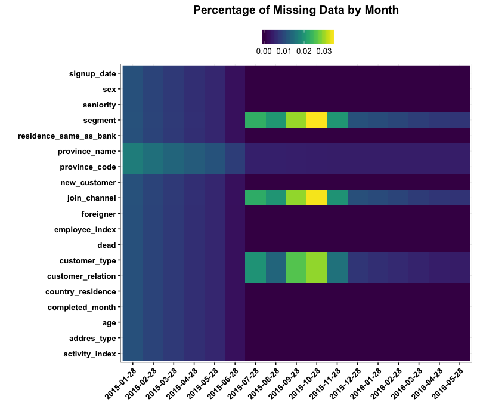

# Missing Data Exploration

While exploring variables I've noticed some interesting patterns with 
missing data and I want to see if there is anything we can learn from 
the variable to variable missingness


```r
suppressPackageStartupMessages(library(readr))
suppressPackageStartupMessages(library(dplyr))
suppressPackageStartupMessages(library(knitr))
suppressPackageStartupMessages(library(tidyr))
suppressPackageStartupMessages(library(purrr))
suppressPackageStartupMessages(library(ggplot2))
source("Santander/lib/helpers.R")
options(dplyr.width = Inf)

raw_data <- read_csv("~/Documents/Data/Kaggle_Comps/Santander/train_ver2.csv", col_types = col_types, progress = F)
```

```r
account_data <- select(raw_data, fecha_dato:segmento) %>% 
  make_calibration %>%
  clean_names

account_data %>%
  map(~ data_frame(pct_missing = mean(is.na(.x)))) %>% 
  bind_rows(.id = "variable") %>%
  ggplot(aes(x = variable, y = pct_missing)) +
  geom_bar(stat = "identity") +
  xlab("") +
  ylab("Percentage Observations Missing") +
  ggtitle("Percentage of Missing Observations by Variable") +
  theme_mells +
  scale_y_continuous(labels = function(x) paste0(x * 100, "%")) +
  coord_flip() +
  theme(axis.text.y = element_text(face = "bold"))
```


Clearly there are 2 crazy bad variables, `leave_date` and `employee_spouse`,
with nearly 100% of their observations missing. `gross_income` is also
pretty bad with around 20% of it's observations missing. I'm going to remove
those and see what patterns exist with the rest of the data. 


```r
missing_data <- account_data %>%
  select(-leave_date, -employee_spouse, -gross_income, -customer_code) %>%
  is.na %>%
  magrittr::multiply_by(1)

missing_rows <- rowSums(missing_data) != 0

missing_data[missing_rows, ] %>%
  data.frame %>%
  mutate(obs = 1:n()) %>%
  gather(Variable, Missing, -obs) %>% 
  mutate(Missing = Missing == 1) %>%
  ggplot(aes(x = obs, y = Variable, fill = Missing)) +
  geom_raster() +
  ylab("") +
  xlab("Observation Number") +
  ggtitle("Patterns of Missing Data Between Variables") +
  theme_mells +
  viridis::scale_fill_viridis(discrete = T) +
  theme(axis.text.y = element_text(face = "bold", hjust = 1),
        legend.position = "top")
```


AJ brought up a good point that the observations in the data are sorted
sequentially by month. I just want to make sure we are right in this 
assumption.


```r
months <- unique(account_data$fetch_date)
  
month_positions <- vapply(months, function(x, all_months = account_data$fetch_date){
  c(min(which(all_months == x)), max(which(all_months == x)))
}, numeric(2)) %>% t

colnames(month_positions) <- c("First Observation", "Last Observation")
month_positions
```

```
##       First Observation Last Observation
##  [1,]                 1           250327
##  [2,]            250328           501360
##  [3,]            501361           753116
##  [4,]            753117          1005366
##  [5,]           1005367          1258233
##  [6,]           1258234          1511205
##  [7,]           1511206          1843204
##  [8,]           1843205          2180591
##  [9,]           2180592          2526846
## [10,]           2526847          2883817
## [11,]           2883818          3246309
## [12,]           3246310          3611251
## [13,]           3611252          3977884
## [14,]           3977885          4346340
## [15,]           4346341          4716475
## [16,]           4716476          5087906
## [17,]           5087907          5460587
```

So we have verified that the data is sorted by month. The issue is we also 
removed a lot of the observations that were in the data since we removed the
observations that weren't missing any values. Let's see if there are any 
patterns for missing values by month and account. 


```r
account_data %>%
  select(-leave_date, -employee_spouse, -gross_income, -customer_code) %>%
  mutate(fetch_date = as.character(fetch_date)) %>%
  group_by(fetch_date) %>%
  mutate_all(is.na) %>%
  summarize_all(mean) %>%
  gather(Variable, Missing, -fetch_date) %>% 
  ggplot(aes(x = fetch_date, y = Variable, fill = Missing)) +
  geom_raster() +
  xlab("") +
  ylab("") +
  ggtitle("Percentage of Missing Data by Month") +
  theme_mells +
  viridis::scale_fill_viridis(discrete = F, name = "") +
  theme(axis.text.y = element_text(face = "bold", hjust = 1),
        axis.text.x = element_text(face = "bold", hjust = 1, angle = 45),
        legend.position = "top")
```




